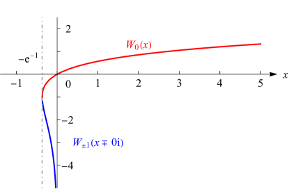

# §4.13 Lambert W-Function

:::{note}
**Defines:**

$\operatorname{Wm}\left(\NVar{x}\right)$ : nonprincipal branch of Lambert $W$ -function , $\operatorname{Wp}\left(\NVar{x}\right)$ : principal branch of Lambert $W$ -function , $T\left(\NVar{z}\right)$ : Tree $T$ -function and $\omega\left(\NVar{z}\right)$ : Wright $\omega$ -function

**Keywords:**

[Lambert $W$-function](http://dlmf.nist.gov/search/search?q=Lambert%20W-function) , [asymptotic expansions](http://dlmf.nist.gov/search/search?q=asymptotic%20expansions) , [definition](http://dlmf.nist.gov/search/search?q=definition) , [notation](http://dlmf.nist.gov/search/search?q=notation) , [other branches](http://dlmf.nist.gov/search/search?q=other%20branches) , [principal branch](http://dlmf.nist.gov/search/search?q=principal%20branch) , [properties](http://dlmf.nist.gov/search/search?q=properties)

**Notes:**

To verify the radius of convergence of the series ( 4.13.6 ) map the plane of $W$ onto the plane of $t$ via $t=(-2v)^{1/2}$ , where $v=W+\ln W+1-i\pi$ . Then $W$ is analytic at $t=0$ , and its nearest singularities to the origin are located at $t=2\sqrt{\pi}e^{\pm\pi i/4}$ . Figure 4.13.1 was produced at NIST.

**Referenced by:**

§26.7(iv) , Erratum (V1.0.7) for References , Erratum (V1.0.9) for References , Erratum (V1.1.7) for Expansion

**Addition (effective with 1.1.11):**

Equation ( 4.13.5_3 ) was added. *Suggested 2023-08-10 by Warren Smith*

**Addition (effective with 1.1.7):**

This section has been enlarged. The Lambert $W$ -function is multi-valued and we use the notation $W_{k}\left(x\right)$ , $k\in\mathbb{Z}$ , for the branches. The original two solutions are identified via $\operatorname{Wp}\left(x\right)=W_{0}\left(x\right)$ and $\operatorname{Wm}\left(x\right)=W_{-1}\left(x+0\mathrm{i}\right)$ . Other changes are the introduction of the Wright $\omega$ -function and tree $T$ -function in ( 4.13.1_2 ) and ( 4.13.1_3 ), simplification formulas ( 4.13.3_1 ) and ( 4.13.3_2 ), explicit representation ( 4.13.4_1 ) for $\frac{{\mathrm{d}}^{n}W}{{\mathrm{d}z}^{n}}$ , additional Maclaurin series ( 4.13.5_1 ) and ( 4.13.5_2 ), an explicit expansion about the branch point at $z=-{\mathrm{e}}^{-1}$ in ( 4.13.9_1 ), extending the number of terms in asymptotic expansions ( 4.13.10 ) and ( 4.13.11 ), and including several integrals and integral representations for Lambert $W$ -functions in the end of the section.

**Addition (effective with 1.0.9):**

The reference to Scott et al. ([2014](./bib/S.html#bib2838 "Numerics of the generalized Lambert W function")) has been added at the end of this section.

**Addition (effective with 1.0.7):**

The references to Scott et al. ([2006](./bib/S.html#bib2829 "General relativity and quantum mechanics: towards a generalization of the Lambert W function: a generalization of the Lambert W function")) and Scott et al. ([2013](./bib/S.html#bib2830 "Asymptotic series of generalized Lambert W function")) have been added at the end of this section.

**See also:**

Annotations for Ch.4
:::

The Lambert $W$ -function $W\left(z\right)$ is the solution of the equation

$$
W{\mathrm{e}}^{W}=z. \tag{4.13.1}
$$

On the $z$ -interval $[0,\infty)$ there is one real solution, and it is nonnegative and increasing. On the $z$ -interval $(-{\mathrm{e}}^{-1},0)$ there are two real solutions, one increasing and the other decreasing. We call the increasing solution for which $W\left(z\right)\geq W\left(-{\mathrm{e}}^{-1}\right)=-1$ the *principal branch* and denote it by $W_{0}\left(z\right)$ . See Figure 4.13.1 .

:::{note}
**Symbols:**

$W\left(\NVar{z}\right)$: Lambert $W$-function , $\mathrm{i}$: imaginary unit and $x$: real variable

**Keywords:**

[Lambert $W$-function](http://dlmf.nist.gov/search/search?q=Lambert%20W-function) , [graphs](http://dlmf.nist.gov/search/search?q=graphs) , [other branches](http://dlmf.nist.gov/search/search?q=other%20branches) , [principal branch](http://dlmf.nist.gov/search/search?q=principal%20branch)

**Referenced by:**

§4.13 , §4.13

**Addition (effective with 1.1.7):**

The notation of the two displayed solutions has been updated.

**See also:**

Annotations for §4.13 and Ch.4
:::

The decreasing solution can be identified as $W_{\pm 1}\left(x\mp 0\mathrm{i}\right)$ . Other solutions of ( 4.13.1 ) are other branches of $W\left(z\right)$ . They are denoted by $W_{k}\left(z\right)$ , $k\in\mathbb{Z}$ , and have the property

$$
W_{k}\left(z\right)={\rm ln}_{k}(z)-\ln\left({\rm ln}_{k}(z)\right)+o\left(1\right), \tag{4.13.1_1}
$$

where ${\rm ln}_{k}(z)=\ln\left(z\right)+2\pi\mathrm{i}k$ . $W_{0}\left(z\right)$ is a single-valued analytic function on $\mathbb{C}\setminus(-\infty,-{\mathrm{e}}^{-1}]$ , real-valued when $z>-{\mathrm{e}}^{-1}$ , and has a square root branch point at $z=-{\mathrm{e}}^{-1}$ . See ( 4.13.6 ) and ( 4.13.9_1 ). The other branches $W_{k}\left(z\right)$ are single-valued analytic functions on $\mathbb{C}\setminus(-\infty,0]$ , have a logarithmic branch point at $z=0$ , and, in the case $k=\pm 1$ , have a square root branch point at $z=-{\mathrm{e}}^{-1}\mp 0\mathrm{i}$ respectively. See Figure 4.13.2 .

:::{note}
**Symbols:**

$W\left(\NVar{z}\right)$: Lambert $W$-function , $\pi$: the ratio of the circumference of a circle to its diameter , $\mathrm{e}$: base of natural logarithm , $\operatorname{ph}$: phase and $z$: complex variable

**Keywords:**

[Lambert $W$-function](http://dlmf.nist.gov/search/search?q=Lambert%20W-function) , [branch cuts](http://dlmf.nist.gov/search/search?q=branch%20cuts)

**Referenced by:**

§4.13

**Addition (effective with 1.1.7):**

This figure was added.

**See also:**

Annotations for §4.13 and Ch.4
:::

*Alternative notations* are $\operatorname{Wp}\left(x\right)$ for $W_{0}\left(x\right)$ , $\operatorname{Wm}\left(x\right)$ for $W_{-1}\left(x+0\mathrm{i}\right)$ , both previously used in this section, the Wright $\omega$ -function $\omega\left(z\right)=W\left({\mathrm{e}}^{z}\right)$ , which is single-valued, satisfies

$$
\omega\left(z\right)+\ln\left(\omega\left(z\right)\right)=z, \tag{4.13.1_2}
$$

and has several advantages over the Lambert $W$ -function (see Lawrence et al. ([2012](./bib/L.html#bib2799 "Algorithm 917: complex double-precision evaluation of the Wright ω function"))), and the tree $T$ -function $T\left(z\right)=-W\left(-z\right)$ , which is a solution of

$$
T{\mathrm{e}}^{-T}=z. \tag{4.13.1_3}
$$

Properties include:

$$
\displaystyle W_{0}\left(-{\mathrm{e}}^{-1}\right) \displaystyle=W_{\pm 1}\left(-{\mathrm{e}}^{-1}\mp 0\mathrm{i}\right)=-1, \tag{4.13.2}
$$

$$
\displaystyle W_{0}\left(0\right) \displaystyle=0,
$$

$$
\displaystyle W_{0}\left(\mathrm{e}\right) \displaystyle=1.
$$

:::{note}
**Symbols:**

$W\left(\NVar{z}\right)$: Lambert $W$-function , $\mathrm{e}$: base of natural logarithm and $\mathrm{i}$: imaginary unit

**See also:**

Annotations for §4.13 and Ch.4
:::

$$
W_{0}\left(x{\mathrm{e}}^{x}\right)=\begin{cases}x,&-1\leq x,\\
\text{(no simpler form)},&x<-1.\end{cases} \tag{4.13.3_1}
$$

$$
W_{\pm 1}\left(x{\mathrm{e}}^{x}\mp 0\mathrm{i}\right)=\begin{cases}\text{(no simpler form)},&-1\leq x,\\
x,&x<-1.\end{cases} \tag{4.13.3_2}
$$

$$
\frac{\mathrm{d}W}{\mathrm{d}z}=\frac{{\mathrm{e}}^{-W}}{1+W}=\frac{W}{z(1+W)}. \tag{4.13.4}
$$

$$
\frac{{\mathrm{d}}^{n}W}{{\mathrm{d}z}^{n}}=\frac{{\mathrm{e}}^{-nW}p_{n-1}(W)}{\left(1+W\right)^{2n-1}}, \tag{4.13.4_1}
$$

in which the $p_{n}(x)$ are polynomials of degree $n$ with

$$
\displaystyle p_{0}(x) \displaystyle=1, \tag{4.13.4_2}
$$

$$
\displaystyle p_{n}(x) \displaystyle=(1+x)p_{n-1}^{\prime}(x)+(1-n(x+3))p_{n-1}(x),
$$

:::{note}
**Symbols:**

$n$: integer and $x$: real variable

**Notes:**

See Corless et al. ([1997](./bib/C.html#bib2958 "A sequence of series for the Lambert W function"), formula (8)).

**Addition (effective with 1.1.7):**

This equation was added.

**See also:**

Annotations for §4.13 and Ch.4
:::

Explicit representations for the $p_{n}(x)$ are given in Kalugin and Jeffrey ([2011](./bib/K.html#bib2956 "Unimodal sequences show that Lambert W is Bernstein")).

$$
W_{0}\left(z\right)=\sum_{n=1}^{\infty}\frac{\left(-n\right)^{n-1}}{n!}z^{n}, \tag{4.13.5}
$$

$$
\left(\frac{W_{0}\left(z\right)}{z}\right)^{a}={\mathrm{e}}^{-aW_{0}\left(z\right)}=\sum_{n=0}^{\infty}\frac{a\left(n+a\right)^{n-1}}{n!}\left(-z\right)^{n}, \tag{4.13.5_1}
$$

$$
\frac{1}{1+W_{0}\left(-z\right)}=\sum_{n=0}^{\infty}\frac{n^{n}}{n!}z^{n}, \tag{4.13.5_2}
$$

$$
\left(1+W_{0}\left(z\right)\right)^{2}=1-2\sum_{n=1}^{\infty}\frac{n^{n-2}}{n!}\left(-z\right)^{n}, \tag{4.13.5_3}
$$

$$
W\left(-{\mathrm{e}}^{-1-(t^{2}/2)}\right)=\sum_{n=0}^{\infty}(-1)^{n-1}c_{n}t^{n}, \tag{4.13.6}
$$

where $t\geq 0$ for $W_{0}$ , $t\leq 0$ for $W_{\pm 1}$ on the relevant branch cuts,

$$
c_{0}=1,\quad c_{1}=1,\quad c_{2}=\tfrac{1}{3},\quad c_{3}=\tfrac{1}{36},\quad
c_{4}=-\tfrac{1}{270}, \tag{4.13.7}
$$

$$
c_{n}=\frac{c_{n-1}}{n+1}-\tfrac{1}{2}\sum_{k=2}^{n-1}c_{k}c_{n+1-k}, \tag{4.13.8}
$$

and

$$
1\cdot 3\cdot 5\cdots(2n+1)c_{2n+1}=g_{n}, \tag{4.13.9}
$$

where $g_{n}$ is defined in § 5.11(i) . See Jeffrey and Murdoch ([2017](./bib/J.html#bib2957 "Stirling Numbers, Lambert W and the Gamma Function")) for an explicit representation for the $c_{n}$ in terms of associated Stirling numbers.

$$
W_{0}\left(z\right)=\sum_{n=0}^{\infty}d_{n}\left(\mathrm{e}z+1\right)^{\ifrac{n}{2}}, \tag{4.13.9_1}
$$

where

$$
\displaystyle d_{0} \displaystyle=-1,\quad d_{1}=\sqrt{2},\quad d_{2}=-\tfrac{2}{3},\quad d_{3}=\tfrac{11}{36}\sqrt{2},\quad d_{4}=-\tfrac{43}{135}, \tag{4.13.9_2}
$$

$$
\displaystyle(n+2)d_{1}d_{n+1} \displaystyle=-2d_{n}+\frac{n}{2}\sum_{k=1}^{n-1}d_{k}d_{n-k}-\frac{n+2}{2}\sum_{k=1}^{n-1}d_{k+1}d_{n-k+1},
$$

:::{note}
**Symbols:**

$k$: integer and $n$: integer

**Addition (effective with 1.1.7):**

This equation was added.

**See also:**

Annotations for §4.13 and Ch.4
:::

For the definition of Stirling cycle numbers of the first kind $\genfrac{[}{]}{0.0pt}{}{n}{k}$ see ( 26.13.3 ). As $\left|z\right|\to\infty$

$$
W_{k}\left(z\right)\sim\xi_{k}-\ln\xi_{k}+\sum_{n=1}^{\infty}\frac{(-1)^{n}}{\xi_{k}^{n}}\sum_{m=1}^{n}\genfrac{[}{]}{0.0pt}{}{n}{n-m+1}\frac{\left(-\ln\xi_{k}\right)^{m}}{m!}, \tag{4.13.10}
$$

where $\xi_{k}=\ln\left(z\right)+2\pi\mathrm{i}k$ . For large enough $\left|z\right|$ the series on the right-hand side of ( 4.13.10 ) is absolutely convergent to its left-hand side. In the case of $k=0$ and real $z$ the series converges for $z\geq\mathrm{e}$ . As $x\to 0-$

$$
W_{\pm 1}\left(x\mp 0\mathrm{i}\right)\sim-\eta-\ln\eta+\sum_{n=1}^{\infty}\frac{1}{\eta^{n}}\sum_{m=1}^{n}\genfrac{[}{]}{0.0pt}{}{n}{n-m+1}\frac{\left(-\ln\eta\right)^{m}}{m!}, \tag{4.13.11}
$$

where $\eta=\ln\left(-1/x\right)$ . For these results and other asymptotic expansions see Corless et al. ([1997](./bib/C.html#bib2958 "A sequence of series for the Lambert W function")).

For integrals of $W\left(z\right)$ use the substitution $w=W\left(z\right)$ , $z=w{\mathrm{e}}^{w}$ and $\,\mathrm{d}z=(w+1){\mathrm{e}}^{w}\,\mathrm{d}w$ . Examples are

$$
\int W\left(z\right)\,\mathrm{d}z=\frac{z}{W\left(z\right)}+zW\left(z\right)-z, \tag{4.13.12}
$$

$$
\int\frac{W\left(z\right)}{z}\,\mathrm{d}z=\tfrac{1}{2}W\left(z\right)^{2}+W\left(z\right), \tag{4.13.13}
$$

$$
2\int\sin\left(W\left(z\right)\right)\,\mathrm{d}z=z\left(1+\frac{1}{W\left(z\right)}\right)\sin\left(W\left(z\right)\right)-z\cos\left(W\left(z\right)\right). \tag{4.13.14}
$$

$$
W_{0}\left(z\right)=\frac{z}{\pi}\int_{0}^{\pi}\frac{\left(1-t\cot t\right)^{2}+t^{2}}{z+t{\mathrm{e}}^{-t\cot t}\csc t}\,\mathrm{d}t. \tag{4.13.15}
$$

$$
W_{0}\left(z\right)=\frac{1}{\pi}\int_{0}^{\pi}\ln\left(1+z\frac{\sin t}{t}{\mathrm{e}}^{t\cot t}\right)\,\mathrm{d}t. \tag{4.13.16}
$$

For these and other integral representations of the Lambert $W$ -function see Kheyfits ([2004](./bib/K.html#bib1266 "Closed-form representations of the Lambert W function")), Kalugin et al. ([2012](./bib/K.html#bib2959 "Bernstein, Pick, Poisson and related integral expressions for Lambert W")) and Mező ([2020](./bib/M.html#bib2961 "An integral representation for the Lambert W function")).

For the foregoing results and further information see Borwein and Corless ([1999](./bib/B.html#bib318 "Emerging tools for experimental mathematics")), Corless et al. ([1996](./bib/C.html#bib585 "On the Lambert W function")), de Bruijn ([1961](./bib/D.html#bib626 "Asymptotic Methods in Analysis"), pp. 25–28), Olver ([1997b](./bib/O.html#bib1809 "Asymptotics and Special Functions"), pp. 12–13), and Siewert and Burniston ([1973](./bib/S.html#bib2083 "Exact analytical solutions of = ⁢ z e z a")).

For a generalization of the Lambert $W$ -function connected to the three-body problem see Scott et al. ([2006](./bib/S.html#bib2829 "General relativity and quantum mechanics: towards a generalization of the Lambert W function: a generalization of the Lambert W function")), Scott et al. ([2013](./bib/S.html#bib2830 "Asymptotic series of generalized Lambert W function")) and Scott et al. ([2014](./bib/S.html#bib2838 "Numerics of the generalized Lambert W function")).
