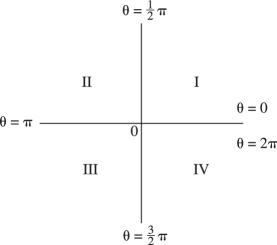

# §4.16 Elementary Properties

:::{note}
**Keywords:**

[elementary properties](http://dlmf.nist.gov/search/search?q=elementary%20properties) , [trigonometric functions](http://dlmf.nist.gov/search/search?q=trigonometric%20functions)

**Notes:**

See Hobson ([1928](./bib/H.html#bib1091 "A Treatise on Plane and Advanced Trigonometry"), pp. 19–24).

**See also:**

Annotations for Ch.4
:::

:::{note}
**See also:**

Annotations for §4.16 and Ch.4
:::

| Quadrant | $\sin\theta,\csc\theta$ | $\cos\theta,\sec\theta$ | $\tan\theta,\cot\theta$ |
|---|---|---|---|
| I | $+$ | $+$ | $+$ |
| II | $+$ | $-$ | $-$ |
| III | $-$ | $-$ | $+$ |
| IV | $-$ | $+$ | $-$ |
: Table 4.16.1: Signs of the trigonometric functions in the four quadrants.

:::{note}
**Symbols:**

$\csc\NVar{z}$: cosecant function , $\cos\NVar{z}$: cosine function , $\cot\NVar{z}$: cotangent function , $\sec\NVar{z}$: secant function , $\sin\NVar{z}$: sine function and $\tan\NVar{z}$: tangent function

**A&S Ref:**

4.3.43

**Referenced by:**

§4.21(iii)

**See also:**

Annotations for §4.16 and Ch.4
:::

|   | **$\sin\theta=a$** | **$\cos\theta=a$** | **$\tan\theta=a$** | **$\csc\theta=a$** | **$\sec\theta=a$** | **$\cot\theta=a$** |
|---|---|---|---|---|---|---|
| **$\sin\theta$** | **$a$** | **$(1-a^{2})^{1/2}$** | **$a(1+a^{2})^{-1/2}$** | **$a^{-1}$** | **$a^{-1}(a^{2}-1)^{1/2}$** | **$(1+a^{2})^{-1/2}$** |
| **$\cos\theta$** | **$(1-a^{2})^{1/2}$** | **$a$** | **$(1+a^{2})^{-1/2}$** | **$a^{-1}(a^{2}-1)^{1/2}$** | **$a^{-1}$** | **$a(1+a^{2})^{-1/2}$** |
| **$\tan\theta$** | **$a(1-a^{2})^{-1/2}$** | **$a^{-1}(1-a^{2})^{1/2}$** | **$a$** | **$(a^{2}-1)^{-1/2}$** | **$(a^{2}-1)^{1/2}$** | **$a^{-1}$** |
| **$\csc\theta$** | **$a^{-1}$** | **$(1-a^{2})^{-1/2}$** | **$a^{-1}(1+a^{2})^{1/2}$** | **$a$** | **$a(a^{2}-1)^{-1/2}$** | **$(1+a^{2})^{1/2}$** |
| **$\sec\theta$** | **$(1-a^{2})^{-1/2}$** | **$a^{-1}$** | **$(1+a^{2})^{1/2}$** | **$a(a^{2}-1)^{-1/2}$** | **$a$** | **$a^{-1}(1+a^{2})^{1/2}$** |
| **$\cot\theta$** | **$a^{-1}(1-a^{2})^{1/2}$** | **$a(1-a^{2})^{-1/2}$** | **$a^{-1}$** | **$(a^{2}-1)^{1/2}$** | **$(a^{2}-1)^{-1/2}$** | **$a$** |
: Table 4.16.3: Trigonometric functions: interrelations.
All square roots have their principal values when
the functions are real, nonnegative, and finite.

:::{note}
**Symbols:**

$\csc\NVar{z}$: cosecant function , $\cos\NVar{z}$: cosine function , $\cot\NVar{z}$: cotangent function , $\sec\NVar{z}$: secant function , $\sin\NVar{z}$: sine function , $\tan\NVar{z}$: tangent function and $a$: real or complex constant

**A&S Ref:**

4.3.45

**Referenced by:**

§4.23(vii) , §4.45(i)

**See also:**

Annotations for §4.16 and Ch.4
:::
