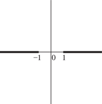

# §4.23 Inverse Trigonometric Functions

:::{note}
**Keywords:**

[inverse trigonometric functions](http://dlmf.nist.gov/search/search?q=inverse%20trigonometric%20functions)

**Referenced by:**

§22.15(i) , §4.2(i)

**See also:**

Annotations for Ch.4
:::

## §4.23(i) General Definitions

:::{note}
**Keywords:**

[analytic properties](http://dlmf.nist.gov/search/search?q=analytic%20properties) , [branch points](http://dlmf.nist.gov/search/search?q=branch%20points) , [definitions](http://dlmf.nist.gov/search/search?q=definitions) , [general values](http://dlmf.nist.gov/search/search?q=general%20values) , [inverse trigonometric functions](http://dlmf.nist.gov/search/search?q=inverse%20trigonometric%20functions)

**Referenced by:**

§4.23(iii) , §4.23(vii)

**See also:**

Annotations for §4.23 and Ch.4
:::

The general values of the inverse trigonometric functions are defined by

$$
\displaystyle\operatorname{Arcsin}z \displaystyle=\int_{0}^{z}\frac{\,\mathrm{d}t}{(1-t^{2})^{1/2}}, \tag{4.23.1}
$$

:::{note}
**Defines:**

$\operatorname{Arcsin}\NVar{z}$ : general arcsine function

**Symbols:**

$\,\mathrm{d}\NVar{x}$: differential of $x$ , $\int$: integral and $z$: complex variable

**A&S Ref:**

4.4.1 (modified)

**Referenced by:**

§4.23(i) , §4.23(ii) , §4.23(iv)

**See also:**

Annotations for §4.23(i) , §4.23 and Ch.4
:::

$$
\displaystyle\operatorname{Arccos}z \displaystyle=\int_{z}^{1}\frac{\,\mathrm{d}t}{(1-t^{2})^{1/2}}, \tag{4.23.2}
$$

:::{note}
**Defines:**

$\operatorname{Arccos}\NVar{z}$ : general arccosine function

**Symbols:**

$\,\mathrm{d}\NVar{x}$: differential of $x$ , $\int$: integral and $z$: complex variable

**A&S Ref:**

4.4.2 (modified)

**Referenced by:**

§4.23(i)

**See also:**

Annotations for §4.23(i) , §4.23 and Ch.4
:::

$$
\displaystyle\operatorname{Arctan}z \displaystyle=\int_{0}^{z}\frac{\,\mathrm{d}t}{1+t^{2}}, \tag{4.23.3}
$$

:::{note}
**Defines:**

$\operatorname{Arctan}\NVar{z}$ : general arctangent function

**Symbols:**

$\,\mathrm{d}\NVar{x}$: differential of $x$ , $\mathrm{i}$: imaginary unit , $\int$: integral and $z$: complex variable

**A&S Ref:**

4.4.3 (modified)

**Referenced by:**

§4.23(i) , §4.23(ii)

**See also:**

Annotations for §4.23(i) , §4.23 and Ch.4
:::

$$
\displaystyle\operatorname{Arccsc}z \displaystyle=\operatorname{Arcsin}\left(1/z\right), \tag{4.23.4}
$$

:::{note}
**Defines:**

$\operatorname{Arccsc}\NVar{z}$ : general arccosecant function

**Symbols:**

$\operatorname{Arcsin}\NVar{z}$: general arcsine function and $z$: complex variable

**A&S Ref:**

4.4.6 (modified)

**See also:**

Annotations for §4.23(i) , §4.23 and Ch.4
:::

$$
\displaystyle\operatorname{Arcsec}z \displaystyle=\operatorname{Arccos}\left(1/z\right), \tag{4.23.5}
$$

:::{note}
**Defines:**

$\operatorname{Arcsec}\NVar{z}$ : general arcsecant function

**Symbols:**

$\operatorname{Arccos}\NVar{z}$: general arccosine function and $z$: complex variable

**A&S Ref:**

4.4.7 (modified)

**See also:**

Annotations for §4.23(i) , §4.23 and Ch.4
:::

$$
\displaystyle\operatorname{Arccot}z \displaystyle=\operatorname{Arctan}\left(1/z\right). \tag{4.23.6}
$$

:::{note}
**Defines:**

$\operatorname{Arccot}\NVar{z}$ : general arccotangent function

**Symbols:**

$\operatorname{Arctan}\NVar{z}$: general arctangent function and $z$: complex variable

**A&S Ref:**

4.4.8 (modified)

**See also:**

Annotations for §4.23(i) , §4.23 and Ch.4
:::

In ( 4.23.1 ) and ( 4.23.2 ) the integration paths may not pass through either of the points $t=\pm 1$ . The function $(1-t^{2})^{1/2}$ assumes its principal value when $t\in(-1,1)$ ; elsewhere on the integration paths the branch is determined by continuity. In ( 4.23.3 ) the integration path may not intersect $\pm i$ . Each of the six functions is a multivalued function of $z$ . $\operatorname{Arctan}z$ and $\operatorname{Arccot}z$ have branch points at $z=\pm\mathrm{i}$ ; the other four functions have branch points at $z=\pm 1$ .

## §4.23(ii) Principal Values

:::{note}
**Defines:**

$\operatorname{arccos}\NVar{z}$ : arccosine function , $\operatorname{arcsin}\NVar{z}$ : arcsine function and $\operatorname{arctan}\NVar{z}$ : arctangent function

**Keywords:**

[inverse trigonometric functions](http://dlmf.nist.gov/search/search?q=inverse%20trigonometric%20functions) , [principal values](http://dlmf.nist.gov/search/search?q=principal%20values)

**Notes:**

See Levinson and Redheffer ([1970](./bib/L.html#bib1426 "Complex Variables"), pp. 68–69).

**Referenced by:**

§14.15(iv) , §14.15(v) , §19.2(iv) , §22.20(ii) , §28.2(iii) , §33.7 , §4.23(iii) , §4.23(vii)

**See also:**

Annotations for §4.23 and Ch.4
:::

The *principal values* (or *principal branches* ) of the inverse sine, cosine, and tangent are obtained by introducing cuts in the $z$ -plane as indicated in Figures 4.23.1 (i) and 4.23.1 (ii), and requiring the integration paths in ( 4.23.1 )–( 4.23.3 ) not to cross these cuts. Compare the principal value of the logarithm (§ 4.2(i) ). The principal branches are denoted by $\operatorname{arcsin}z$ , $\operatorname{arccos}z$ , $\operatorname{arctan}z$ , respectively. Each is two-valued on the corresponding cuts, and each is real on the part of the real axis that remains after deleting the intersections with the corresponding cuts.

The principal values of the inverse cosecant, secant, and cotangent are given by

$$
\displaystyle\operatorname{arccsc}z \displaystyle=\operatorname{arcsin}\left(1/z\right), \tag{4.23.7}
$$

:::{note}
**Defines:**

$\operatorname{arccsc}\NVar{z}$ : arccosecant function

**Symbols:**

$\operatorname{arcsin}\NVar{z}$: arcsine function and $z$: complex variable

**Referenced by:**

§4.23(iv) , §4.45(ii)

**See also:**

Annotations for §4.23(ii) , §4.23 and Ch.4
:::

$$
\displaystyle\operatorname{arcsec}z \displaystyle=\operatorname{arccos}\left(1/z\right). \tag{4.23.8}
$$

:::{note}
**Defines:**

$\operatorname{arcsec}\NVar{z}$ : arcsecant function

**Symbols:**

$\operatorname{arccos}\NVar{z}$: arccosine function and $z$: complex variable

**See also:**

Annotations for §4.23(ii) , §4.23 and Ch.4
:::

$$
\displaystyle\operatorname{arccot}z \displaystyle=\operatorname{arctan}\left(1/z\right), \tag{4.23.9}
$$

:::{note}
**Defines:**

$\operatorname{arccot}\NVar{z}$ : arccotangent function

**Symbols:**

$\mathrm{i}$: imaginary unit , $\operatorname{arctan}\NVar{z}$: arctangent function and $z$: complex variable

**Referenced by:**

§4.23(iv) , §4.45(ii)

**See also:**

Annotations for §4.23(ii) , §4.23 and Ch.4
:::

These functions are analytic in the cut plane depicted in Figures 4.23.1 (iii) and 4.23.1 (iv).

*Except where indicated otherwise* , it is assumed throughout the DLMF that the inverse trigonometric functions assume their principal values.

:::{note}
**Symbols:**

$\operatorname{arccsc}\NVar{z}$: arccosecant function , $\operatorname{arccos}\NVar{z}$: arccosine function , $\operatorname{arccot}\NVar{z}$: arccotangent function , $\operatorname{arcsec}\NVar{z}$: arcsecant function , $\operatorname{arcsin}\NVar{z}$: arcsine function , $\operatorname{arctan}\NVar{z}$: arctangent function and $z$: complex variable

**Keywords:**

[branch cuts](http://dlmf.nist.gov/search/search?q=branch%20cuts) , [inverse trigonometric functions](http://dlmf.nist.gov/search/search?q=inverse%20trigonometric%20functions)

**Referenced by:**

§4.23(iv) , §4.23(iv) , §4.23(iv) , §4.23(ii) , §4.23(ii) , §4.25 , §4.9(i)

**See also:**

Annotations for §4.23(ii) , §4.23 and Ch.4
:::

Graphs of the principal values for real arguments are given in § [4.15](./4.15.md "§4.15 Graphics ‣ Trigonometric Functions ‣ Chapter 4 Elementary Functions") . This section also includes conformal mappings, and surface plots for complex arguments.

## §4.23(iii) Reflection Formulas

:::{note}
**Keywords:**

[inverse trigonometric functions](http://dlmf.nist.gov/search/search?q=inverse%20trigonometric%20functions) , [reflection formulas](http://dlmf.nist.gov/search/search?q=reflection%20formulas)

**Notes:**

These results follow from the definitions in §§ 4.23(i) , 4.23(ii) .

**See also:**

Annotations for §4.23 and Ch.4
:::

$$
\displaystyle\operatorname{arcsin}\left(-z\right) \displaystyle=-\operatorname{arcsin}z, \tag{4.23.10}
$$

:::{note}
**Symbols:**

$\operatorname{arcsin}\NVar{z}$: arcsine function and $z$: complex variable

**A&S Ref:**

4.4.14

**See also:**

Annotations for §4.23(iii) , §4.23 and Ch.4
:::

$$
\displaystyle\operatorname{arccos}\left(-z\right) \displaystyle=\pi-\operatorname{arccos}z. \tag{4.23.11}
$$

:::{note}
**Symbols:**

$\pi$: the ratio of the circumference of a circle to its diameter , $\operatorname{arccos}\NVar{z}$: arccosine function and $z$: complex variable

**A&S Ref:**

4.4.15

**See also:**

Annotations for §4.23(iii) , §4.23 and Ch.4
:::

$$
\displaystyle\operatorname{arctan}\left(-z\right) \displaystyle=-\operatorname{arctan}z, \tag{4.23.12}
$$

:::{note}
**Symbols:**

$\mathrm{i}$: imaginary unit , $\operatorname{arctan}\NVar{z}$: arctangent function and $z$: complex variable

**A&S Ref:**

4.4.16

**See also:**

Annotations for §4.23(iii) , §4.23 and Ch.4
:::

$$
\displaystyle\operatorname{arccsc}\left(-z\right) \displaystyle=-\operatorname{arccsc}z, \tag{4.23.13}
$$

:::{note}
**Symbols:**

$\operatorname{arccsc}\NVar{z}$: arccosecant function and $z$: complex variable

**A&S Ref:**

4.4.17

**See also:**

Annotations for §4.23(iii) , §4.23 and Ch.4
:::

$$
\displaystyle\operatorname{arcsec}\left(-z\right) \displaystyle=\pi-\operatorname{arcsec}z. \tag{4.23.14}
$$

:::{note}
**Symbols:**

$\pi$: the ratio of the circumference of a circle to its diameter , $\operatorname{arcsec}\NVar{z}$: arcsecant function and $z$: complex variable

**A&S Ref:**

4.4.18

**See also:**

Annotations for §4.23(iii) , §4.23 and Ch.4
:::

$$
\displaystyle\operatorname{arccot}\left(-z\right) \displaystyle=-\operatorname{arccot}z, \tag{4.23.15}
$$

:::{note}
**Symbols:**

$\mathrm{i}$: imaginary unit , $\operatorname{arccot}\NVar{z}$: arccotangent function and $z$: complex variable

**A&S Ref:**

4.4.19 (Early printings had an error.)

**See also:**

Annotations for §4.23(iii) , §4.23 and Ch.4
:::

$$
\displaystyle\operatorname{arccos}z \displaystyle=\tfrac{1}{2}\pi-\operatorname{arcsin}z, \tag{4.23.16}
$$

:::{note}
**Symbols:**

$\pi$: the ratio of the circumference of a circle to its diameter , $\operatorname{arccos}\NVar{z}$: arccosine function , $\operatorname{arcsin}\NVar{z}$: arcsine function and $z$: complex variable

**A&S Ref:**

4.4.2

**Referenced by:**

§4.15(iii) , §4.23(iv)

**See also:**

Annotations for §4.23(iii) , §4.23 and Ch.4
:::

$$
\displaystyle\operatorname{arcsec}z \displaystyle=\tfrac{1}{2}\pi-\operatorname{arccsc}z. \tag{4.23.17}
$$

:::{note}
**Symbols:**

$\pi$: the ratio of the circumference of a circle to its diameter , $\operatorname{arccsc}\NVar{z}$: arccosecant function , $\operatorname{arcsec}\NVar{z}$: arcsecant function and $z$: complex variable

**A&S Ref:**

4.4.9

**See also:**

Annotations for §4.23(iii) , §4.23 and Ch.4
:::

$$
\displaystyle\operatorname{arccot}z \displaystyle=\pm\tfrac{1}{2}\pi-\operatorname{arctan}z, \tag{4.23.18}
$$

:::{note}
**Symbols:**

$\pi$: the ratio of the circumference of a circle to its diameter , $\operatorname{arccot}\NVar{z}$: arccotangent function , $\operatorname{arctan}\NVar{z}$: arctangent function , $\Re$: real part and $z$: complex variable

**A&S Ref:**

4.4.5 (The first printing had an error.)

**Referenced by:**

§4.15(iii)

**See also:**

Annotations for §4.23(iii) , §4.23 and Ch.4
:::

## §4.23(iv) Logarithmic Forms

:::{note}
**Keywords:**

[inverse trigonometric functions](http://dlmf.nist.gov/search/search?q=inverse%20trigonometric%20functions) , [logarithmic forms](http://dlmf.nist.gov/search/search?q=logarithmic%20forms) , [values on the cuts](http://dlmf.nist.gov/search/search?q=values%20on%20the%20cuts)

**Notes:**

To verify ( 4.23.19 ), denote the right-hand side by $\phi(z)$ , and the domain $\mathbb{C}\setminus(-\infty,-1]\cup[1,\infty)$ by $D$ . If $z=x\in(-1,1)$ , then $\phi^{\prime}(x)=(1-x^{2})^{-1/2}$ and $\phi(0)=0$ . Hence ( 4.23.19 ) applies; compare ( 4.23.1 ) with $\operatorname{Arcsin}$ replaced by $\operatorname{arcsin}$ . We may now extend ( 4.23.19 ) to the rest of $D$ simply by showing that $\phi(z)$ is analytic on $D$ ; compare § 1.10(ii) . Since the principal value of $(1-z^{2})^{1/2}$ is analytic on $D$ , the only possible singularities of $\phi(z)$ occur on the branch cut of the logarithm, that is, when $(1-z^{2})^{1/2}=-iz-t$ with $t\in[0,\infty)$ . By squaring the last equation we see that $(1-z^{2})^{1/2}+iz$ is real only when $z$ lies on the imaginary axis, and it is then positive. The proofs of ( 4.23.22 ), ( 4.23.23 ), ( 4.23.26 ) are similar, or in the case of ( 4.23.22 ) we may simply refer to ( 4.23.16 ).

**Referenced by:**

§4.37(iv) , §4.37(iv) , §4.45(ii)

**See also:**

Annotations for §4.23 and Ch.4
:::

Throughout this subsection *all* quantities assume their principal values.

### Inverse Sine

:::{note}
**See also:**

Annotations for §4.23(iv) , §4.23 and Ch.4
:::

$$
\operatorname{arcsin}z=-i\ln\left((1-z^{2})^{1/2}+iz\right), \tag{4.23.19}
$$

compare Figure 4.23.1 (i). On the cuts

$$
\displaystyle\operatorname{arcsin}x \displaystyle=\tfrac{1}{2}\pi\pm i\ln\left((x^{2}-1)^{1/2}+x\right), \tag{4.23.20}
$$

:::{note}
**Symbols:**

$\pi$: the ratio of the circumference of a circle to its diameter , $[\NVar{a},\NVar{b})$: half-closed interval , $\in$: element of , $\mathrm{i}$: imaginary unit , $\operatorname{arcsin}\NVar{z}$: arcsine function , $\ln\NVar{z}$: principal branch of logarithm function and $x$: real variable

**See also:**

Annotations for §4.23(iv) , §4.23(iv) , §4.23 and Ch.4
:::

$$
\displaystyle\operatorname{arcsin}x \displaystyle=-\tfrac{1}{2}\pi\pm i\ln\left((x^{2}-1)^{1/2}-x\right), \tag{4.23.21}
$$

:::{note}
**Symbols:**

$\pi$: the ratio of the circumference of a circle to its diameter , $\in$: element of , $\mathrm{i}$: imaginary unit , $\operatorname{arcsin}\NVar{z}$: arcsine function , $\ln\NVar{z}$: principal branch of logarithm function , $(\NVar{a},\NVar{b}]$: half-closed interval and $x$: real variable

**See also:**

Annotations for §4.23(iv) , §4.23(iv) , §4.23 and Ch.4
:::

upper signs being taken on upper sides, and lower signs on lower sides.

### Inverse Cosine

:::{note}
**See also:**

Annotations for §4.23(iv) , §4.23 and Ch.4
:::

$$
\operatorname{arccos}z=\tfrac{1}{2}\pi+i\ln\left((1-z^{2})^{1/2}+iz\right), \tag{4.23.22}
$$

compare Figure 4.23.1 (i). An equivalent definition is

$$
\operatorname{arccos}z=-2i\ln\left(\left(\frac{1+z}{2}\right)^{1/2}+i\left(\frac{1-z}{2}\right)^{1/2}\right), \tag{4.23.23}
$$

see Kahan ([1987](./bib/K.html#bib1202 "Branch Cuts for Complex Elementary Functions or Much Ado About Nothing’s Sign Bit")).

On the cuts

$$
\displaystyle\operatorname{arccos}x \displaystyle=\mp i\ln\left((x^{2}-1)^{1/2}+x\right), \tag{4.23.24}
$$

:::{note}
**Symbols:**

$[\NVar{a},\NVar{b})$: half-closed interval , $\in$: element of , $\mathrm{i}$: imaginary unit , $\operatorname{arccos}\NVar{z}$: arccosine function , $\ln\NVar{z}$: principal branch of logarithm function and $x$: real variable

**See also:**

Annotations for §4.23(iv) , §4.23(iv) , §4.23 and Ch.4
:::

$$
\displaystyle\operatorname{arccos}x \displaystyle=\pi\mp i\ln\left((x^{2}-1)^{1/2}-x\right), \tag{4.23.25}
$$

:::{note}
**Symbols:**

$\pi$: the ratio of the circumference of a circle to its diameter , $\in$: element of , $\mathrm{i}$: imaginary unit , $\operatorname{arccos}\NVar{z}$: arccosine function , $\ln\NVar{z}$: principal branch of logarithm function , $(\NVar{a},\NVar{b}]$: half-closed interval and $x$: real variable

**See also:**

Annotations for §4.23(iv) , §4.23(iv) , §4.23 and Ch.4
:::

the upper/lower signs corresponding to the upper/lower sides.

### Inverse Tangent

:::{note}
**See also:**

Annotations for §4.23(iv) , §4.23 and Ch.4
:::

$$
\operatorname{arctan}z=\frac{i}{2}\ln\left(\frac{i+z}{i-z}\right), \tag{4.23.26}
$$

compare Figure 4.23.1 (ii). On the cuts

$$
\operatorname{arctan}\left(iy\right)=\pm\frac{1}{2}\pi+\frac{i}{2}\ln\left(\frac{y+1}{y-1}\right), \tag{4.23.27}
$$

the upper/lower sign corresponding to the right/left side.

### Other Inverse Functions

:::{note}
**Keywords:**

[inverse trigonometric functions](http://dlmf.nist.gov/search/search?q=inverse%20trigonometric%20functions) , [logarithmic forms](http://dlmf.nist.gov/search/search?q=logarithmic%20forms) , [values on the cuts](http://dlmf.nist.gov/search/search?q=values%20on%20the%20cuts)

**See also:**

Annotations for §4.23(iv) , §4.23 and Ch.4
:::

For the corresponding results for $\operatorname{arccsc}z$ , $\operatorname{arcsec}z$ , and $\operatorname{arccot}z$ , use ( 4.23.7 )–( 4.23.9 ). Care needs to be taken on the cuts, for example, if $0<x<\infty$ then $1/(x+i0)=(1/x)-i0$ .

## §4.23(v) Fundamental Property

:::{note}
**Keywords:**

[fundamental property](http://dlmf.nist.gov/search/search?q=fundamental%20property) , [inverse trigonometric functions](http://dlmf.nist.gov/search/search?q=inverse%20trigonometric%20functions)

**Notes:**

See Hobson ([1928](./bib/H.html#bib1091 "A Treatise on Plane and Advanced Trigonometry"), pp. 32–33), Levinson and Redheffer ([1970](./bib/L.html#bib1426 "Complex Variables"), pp. 68–70).

**See also:**

Annotations for §4.23 and Ch.4
:::

With $k\in\mathbb{Z}$ , the general solutions of the equations

$$
\displaystyle z \displaystyle=\sin w, \tag{4.23.28}
$$

:::{note}
**Symbols:**

$\sin\NVar{z}$: sine function and $z$: complex variable

**See also:**

Annotations for §4.23(v) , §4.23 and Ch.4
:::

$$
\displaystyle z \displaystyle=\cos w, \tag{4.23.29}
$$

:::{note}
**Symbols:**

$\cos\NVar{z}$: cosine function and $z$: complex variable

**See also:**

Annotations for §4.23(v) , §4.23 and Ch.4
:::

$$
\displaystyle z \displaystyle=\tan w, \tag{4.23.30}
$$

:::{note}
**Symbols:**

$\tan\NVar{z}$: tangent function and $z$: complex variable

**See also:**

Annotations for §4.23(v) , §4.23 and Ch.4
:::

are respectively

$$
\displaystyle w \displaystyle=\operatorname{Arcsin}z=(-1)^{k}\operatorname{arcsin}z+k\pi, \tag{4.23.31}
$$

:::{note}
**Symbols:**

$\pi$: the ratio of the circumference of a circle to its diameter , $\operatorname{arcsin}\NVar{z}$: arcsine function , $\operatorname{Arcsin}\NVar{z}$: general arcsine function , $k$: integer and $z$: complex variable

**A&S Ref:**

4.4.10

**See also:**

Annotations for §4.23(v) , §4.23 and Ch.4
:::

$$
\displaystyle w \displaystyle=\operatorname{Arccos}z=\pm\operatorname{arccos}z+2k\pi, \tag{4.23.32}
$$

:::{note}
**Symbols:**

$\pi$: the ratio of the circumference of a circle to its diameter , $\operatorname{arccos}\NVar{z}$: arccosine function , $\operatorname{Arccos}\NVar{z}$: general arccosine function , $k$: integer and $z$: complex variable

**A&S Ref:**

4.4.11

**See also:**

Annotations for §4.23(v) , §4.23 and Ch.4
:::

$$
\displaystyle w \displaystyle=\operatorname{Arctan}z=\operatorname{arctan}z+k\pi, \tag{4.23.33}
$$

:::{note}
**Symbols:**

$\pi$: the ratio of the circumference of a circle to its diameter , $\mathrm{i}$: imaginary unit , $\operatorname{arctan}\NVar{z}$: arctangent function , $\operatorname{Arctan}\NVar{z}$: general arctangent function , $k$: integer and $z$: complex variable

**A&S Ref:**

4.4.12

**See also:**

Annotations for §4.23(v) , §4.23 and Ch.4
:::

## §4.23(vi) Real and Imaginary Parts

:::{note}
**Keywords:**

[inverse trigonometric functions](http://dlmf.nist.gov/search/search?q=inverse%20trigonometric%20functions) , [real and imaginary parts](http://dlmf.nist.gov/search/search?q=real%20and%20imaginary%20parts)

**Notes:**

See Hobson ([1928](./bib/H.html#bib1091 "A Treatise on Plane and Advanced Trigonometry"), pp. 332–333).

**Referenced by:**

Erratum (V1.2.4) for Additions

**Addition (effective with 1.2.4):**

A sentence was added at the end of this subsection giving a citation to Dempsey ([2025](./bib/D.html#bib3131 "Principal Branches of Inverse Trigonometric and Inverse Hyperbolic Functions")) for more concrete principal branch expressions involving inverse trigonometric functions.

**See also:**

Annotations for §4.23 and Ch.4
:::

$$
\displaystyle\operatorname{arcsin}z \displaystyle=\operatorname{arcsin}\beta+\mathrm{i}\operatorname{sign}\left(y\right)\ln\left(\alpha+(\alpha^{2}-1)^{1/2}\right), \tag{4.23.34}
$$

:::{note}
**Symbols:**

$[\NVar{a},\NVar{b}]$: closed interval , $\in$: element of , $\mathrm{i}$: imaginary unit , $\operatorname{arcsin}\NVar{z}$: arcsine function , $\ln\NVar{z}$: principal branch of logarithm function , $\notin$: not an element of , $(\NVar{a},\NVar{b})$: open interval , $\operatorname{sign}\NVar{x}$: sign of , $x$: real variable , $y$: real variable , $z$: complex variable , $\alpha$ and $\beta$

**A&S Ref:**

4.4.37 (with the general value.)

**Referenced by:**

§4.23(vi) , Erratum (V1.0.7) for Equations (4.23.34) and (4.23.35)

**Errata (effective with 1.0.7):**

Originally the factor $\operatorname{sign}\left(y\right)$ was missing from the second term on the right side of this equation. Also, the originally stated condition $x\in[-1,1]$ for this equation, stated on the line following ( 4.23.36 ), was replaced with the more general condition $\pm z\notin(1,\infty)$ . *Reported 2013-07-01 by Volker Thürey*

**See also:**

Annotations for §4.23(vi) , §4.23 and Ch.4
:::

$$
\displaystyle\operatorname{arccos}z \displaystyle=\operatorname{arccos}\beta-\mathrm{i}\operatorname{sign}\left(y\right)\ln\left(\alpha+(\alpha^{2}-1)^{1/2}\right), \tag{4.23.35}
$$

:::{note}
**Symbols:**

$[\NVar{a},\NVar{b}]$: closed interval , $\in$: element of , $\mathrm{i}$: imaginary unit , $\operatorname{arccos}\NVar{z}$: arccosine function , $\ln\NVar{z}$: principal branch of logarithm function , $\notin$: not an element of , $(\NVar{a},\NVar{b})$: open interval , $\operatorname{sign}\NVar{x}$: sign of , $x$: real variable , $y$: real variable , $z$: complex variable , $\alpha$ and $\beta$

**A&S Ref:**

4.4.38 (with the general value.)

**Referenced by:**

§4.23(vi) , Erratum (V1.0.7) for Equations (4.23.34) and (4.23.35)

**Errata (effective with 1.0.7):**

Originally the factor $\operatorname{sign}\left(y\right)$ was missing from the second term on the right side of this equation. Also, the originally stated condition $x\in[-1,1]$ for this equation, stated on the line following ( 4.23.36 ), was replaced with the more general condition $\pm z\notin(1,\infty)$ . *Reported 2013-07-01 by Volker Thürey*

**See also:**

Annotations for §4.23(vi) , §4.23 and Ch.4
:::

$$
\displaystyle\operatorname{arctan}z \displaystyle=\tfrac{1}{2}\operatorname{arctan}\left(\frac{2x}{1-x^{2}-y^{2}}\right)+\tfrac{1}{4}i\ln\left(\frac{x^{2}+(y+1)^{2}}{x^{2}+(y-1)^{2}}\right), \tag{4.23.36}
$$

:::{note}
**Symbols:**

$\mathrm{i}$: imaginary unit , $\operatorname{arctan}\NVar{z}$: arctangent function , $\ln\NVar{z}$: principal branch of logarithm function , $x$: real variable , $y$: real variable and $z$: complex variable

**A&S Ref:**

4.4.39 (with the general value.)

**Referenced by:**

(4.23.34) , (4.23.35) , §4.23(vi)

**See also:**

Annotations for §4.23(vi) , §4.23 and Ch.4
:::

where $z=x+\mathrm{i}y$ and $\pm z\notin(1,\infty)$ in ( 4.23.34 ) and ( 4.23.35 ), and $\left|z\right|<1$ in ( 4.23.36 ). Also,

$$
\displaystyle\alpha \displaystyle=\tfrac{1}{2}\left((x+1)^{2}+y^{2}\right)^{1/2}+\tfrac{1}{2}\left((x-1)^{2}+y^{2}\right)^{1/2}, \tag{4.23.37}
$$

:::{note}
**Defines:**

$\alpha$ (locally)

**Symbols:**

$x$: real variable and $y$: real variable

**See also:**

Annotations for §4.23(vi) , §4.23 and Ch.4
:::

$$
\displaystyle\beta \displaystyle=\tfrac{1}{2}\left((x+1)^{2}+y^{2}\right)^{1/2}-\tfrac{1}{2}\left((x-1)^{2}+y^{2}\right)^{1/2}. \tag{4.23.38}
$$

:::{note}
**Defines:**

$\beta$ (locally)

**Symbols:**

$x$: real variable and $y$: real variable

**See also:**

Annotations for §4.23(vi) , §4.23 and Ch.4
:::

For more concrete principal branch expressions for inverse trigonometric functions see Dempsey ([2025](./bib/D.html#bib3131 "Principal Branches of Inverse Trigonometric and Inverse Hyperbolic Functions")).

## §4.23(vii) Special Values and Interrelations

:::{note}
**Keywords:**

[interrelations](http://dlmf.nist.gov/search/search?q=interrelations) , [inverse trigonometric functions](http://dlmf.nist.gov/search/search?q=inverse%20trigonometric%20functions) , [special values](http://dlmf.nist.gov/search/search?q=special%20values)

**Notes:**

Table 4.23.1 is constructed from the definitions in §§ 4.23(i) , 4.23(ii) .

**See also:**

Annotations for §4.23 and Ch.4
:::

| **$x$** | **$\operatorname{arcsin}x$** | **$\operatorname{arccos}x$** | **$\operatorname{arctan}x$** | **$\operatorname{arccsc}x$** | **$\operatorname{arcsec}x$** | **$\operatorname{arccot}x$** |
|---|---|---|---|---|---|---|
| **$-\infty$** | **–** | **–** | **$-\tfrac{1}{2}\pi$** | **$0$** | **$\tfrac{1}{2}\pi$** | **$0$** |
| **$-1$** | **$-\tfrac{1}{2}\pi$** | **$\pi$** | **$-\tfrac{1}{4}\pi$** | **$-\tfrac{1}{2}\pi$** | **$\pi$** | **$-\tfrac{1}{4}\pi$** |
| **$0$** | **$0$** | **$\tfrac{1}{2}\pi$** | **$0$** | **–** | **–** | **$\mp\tfrac{1}{2}\pi$** |
| **$1$** | **$\tfrac{1}{2}\pi$** | **$0$** | **$\tfrac{1}{4}\pi$** | **$\tfrac{1}{2}\pi$** | **$0$** | **$\tfrac{1}{4}\pi$** |
| **$\infty$** | **–** | **–** | **$\tfrac{1}{2}\pi$** | **$0$** | **$\tfrac{1}{2}\pi$** | **$0$** |
: Table 4.23.1: Inverse trigonometric functions: principal values at 0, ± 1 , ± ∞ .

:::{note}
**Symbols:**

$\pi$: the ratio of the circumference of a circle to its diameter , $\operatorname{arccsc}\NVar{z}$: arccosecant function , $\operatorname{arccos}\NVar{z}$: arccosine function , $\operatorname{arccot}\NVar{z}$: arccotangent function , $\operatorname{arcsec}\NVar{z}$: arcsecant function , $\operatorname{arcsin}\NVar{z}$: arcsine function , $\operatorname{arctan}\NVar{z}$: arctangent function and $x$: real variable

**Referenced by:**

§4.23(vii)

**See also:**

Annotations for §4.23(vii) , §4.23 and Ch.4
:::

For interrelations see Table 4.16.3 . For example, from the heading and last entry in the penultimate column we have $\operatorname{arcsec}a=\operatorname{arccot}\left((a^{2}-1)^{-1/2}\right)$ .

## §4.23(viii) Gudermannian Function

:::{note}
**Keywords:**

[Gudermannian function](http://dlmf.nist.gov/search/search?q=Gudermannian%20function) , [inverse](http://dlmf.nist.gov/search/search?q=inverse) , [inverse Gudermannian function](http://dlmf.nist.gov/search/search?q=inverse%20Gudermannian%20function)

**Notes:**

See Fletcher et al. ([1962](./bib/F.html#bib810 "An Index of Mathematical Tables. Vols. I, II"), §§12.1, 12.2). ( 4.23.40 ) and ( 4.23.42 ) may be verified by differentiation plus comparison of values as $x\to 0$ .

**Referenced by:**

§19.10(ii) , §19.6(ii) , §22.16(i)

**See also:**

Annotations for §4.23 and Ch.4
:::

The *Gudermannian* $\operatorname{gd}\left(x\right)$ is defined by

$$
\operatorname{gd}\left(x\right)=\int_{0}^{x}\operatorname{sech}t\,\mathrm{d}t, \tag{4.23.39}
$$

Equivalently,

$$
\operatorname{gd}\left(x\right)=2\operatorname{arctan}\left(e^{x}\right)-\tfrac{1}{2}\pi\\
=\operatorname{arcsin}\left(\tanh x\right)=\operatorname{arccsc}\left(\coth x\right)\\
=\operatorname{arccos}\left(\operatorname{sech}x\right)=\operatorname{arcsec}\left(\cosh x\right)\\
=\operatorname{arctan}\left(\sinh x\right)=\operatorname{arccot}\left(\operatorname{csch}x\right). \tag{4.23.40}
$$

The inverse Gudermannian function is given by

$$
{\operatorname{gd}^{-1}}\left(x\right)=\int_{0}^{x}\sec t\,\mathrm{d}t, \tag{4.23.41}
$$

Equivalently, and again when $-\frac{1}{2}\pi<x<\frac{1}{2}\pi$ ,

$$
{\operatorname{gd}^{-1}}\left(x\right)=\ln\tan\left(\tfrac{1}{2}x+\tfrac{1}{4}\pi\right)=\ln\left(\sec x+\tan x\right)=\operatorname{arcsinh}\left(\tan x\right)=\operatorname{arccsch}\left(\cot x\right)=\operatorname{arccosh}\left(\sec x\right)=\operatorname{arcsech}\left(\cos x\right)=\operatorname{arctanh}\left(\sin x\right)=\operatorname{arccoth}\left(\csc x\right). \tag{4.23.42}
$$
