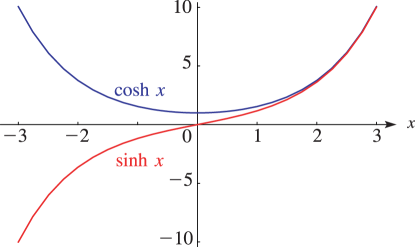
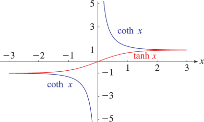
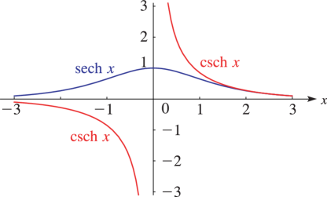

# §4.29 Graphics

:::{note}
**Referenced by:**

§4.37(ii)

**See also:**

Annotations for Ch.4
:::

## §4.29(i) Real Arguments

:::{note}
**Keywords:**

[graphics](http://dlmf.nist.gov/search/search?q=graphics) , [hyperbolic functions](http://dlmf.nist.gov/search/search?q=hyperbolic%20functions) , [inverse hyperbolic functions](http://dlmf.nist.gov/search/search?q=inverse%20hyperbolic%20functions) , [real argument](http://dlmf.nist.gov/search/search?q=real%20argument)

**Notes:**

These graphs were produced at NIST.

**See also:**

Annotations for §4.29 and Ch.4
:::

:::{note}
**Symbols:**

$\cosh\NVar{z}$: hyperbolic cosine function , $\sinh\NVar{z}$: hyperbolic sine function and $x$: real variable

**A&S Ref:**

AMS55 (Figure 4.6)

**See also:**

Annotations for §4.29(i) , §4.29 and Ch.4
:::

:::{note}
**Symbols:**

$\coth\NVar{z}$: hyperbolic cotangent function , $\tanh\NVar{z}$: hyperbolic tangent function and $x$: real variable

**A&S Ref:**

AMS55 (Figure 4.6)

**See also:**

Annotations for §4.29(i) , §4.29 and Ch.4
:::

:::{note}
**Symbols:**

$\operatorname{csch}\NVar{z}$: hyperbolic cosecant function , $\operatorname{sech}\NVar{z}$: hyperbolic secant function and $x$: real variable

**A&S Ref:**

AMS55 (Figure 4.6)

**See also:**

Annotations for §4.29(i) , §4.29 and Ch.4
:::

## §4.29(ii) Complex Arguments

:::{note}
**Keywords:**

[complex argument](http://dlmf.nist.gov/search/search?q=complex%20argument) , [conformal maps](http://dlmf.nist.gov/search/search?q=conformal%20maps) , [graphics](http://dlmf.nist.gov/search/search?q=graphics) , [hyperbolic functions](http://dlmf.nist.gov/search/search?q=hyperbolic%20functions) , [inverse hyperbolic functions](http://dlmf.nist.gov/search/search?q=inverse%20hyperbolic%20functions)

**See also:**

Annotations for §4.29 and Ch.4
:::

The conformal mapping $w=\sinh z$ is obtainable from Figure 4.15.7 by rotating both the $w$ -plane and the $z$ -plane through an angle $\frac{1}{2}\pi$ , compare ( 4.28.8 ).

The surfaces for the complex hyperbolic and inverse hyperbolic functions are similar to the surfaces depicted in § 4.15(iii) for the trigonometric and inverse trigonometric functions. They can be visualized with the aid of equations ( 4.28.8 )–( 4.28.13 ).
