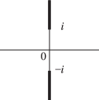

# §4.37 Inverse Hyperbolic Functions

:::{note}
**Keywords:**

[inverse hyperbolic functions](http://dlmf.nist.gov/search/search?q=inverse%20hyperbolic%20functions)

**Referenced by:**

§4.2(i)

**See also:**

Annotations for Ch.4
:::

## §4.37(i) General Definitions

:::{note}
**Keywords:**

[analytic properties](http://dlmf.nist.gov/search/search?q=analytic%20properties) , [branch points](http://dlmf.nist.gov/search/search?q=branch%20points) , [definitions](http://dlmf.nist.gov/search/search?q=definitions) , [general values](http://dlmf.nist.gov/search/search?q=general%20values) , [inverse hyperbolic functions](http://dlmf.nist.gov/search/search?q=inverse%20hyperbolic%20functions)

**See also:**

Annotations for §4.37 and Ch.4
:::

The general values of the inverse hyperbolic functions are defined by

$$
\displaystyle\operatorname{Arcsinh}z \displaystyle=\int_{0}^{z}\frac{\,\mathrm{d}t}{(1+t^{2})^{1/2}}, \tag{4.37.1}
$$

:::{note}
**Defines:**

$\operatorname{Arcsinh}\NVar{z}$ : general inverse hyperbolic sine function

**Symbols:**

$\,\mathrm{d}\NVar{x}$: differential of $x$ , $\int$: integral and $z$: complex variable

**Referenced by:**

§4.37(i) , §4.37(ii)

**See also:**

Annotations for §4.37(i) , §4.37 and Ch.4
:::

$$
\displaystyle\operatorname{Arccosh}z \displaystyle=\int_{1}^{z}\frac{\,\mathrm{d}t}{(t^{2}-1)^{1/2}}, \tag{4.37.2}
$$

:::{note}
**Defines:**

$\operatorname{Arccosh}\NVar{z}$ : general inverse hyperbolic cosine function

**Symbols:**

$\,\mathrm{d}\NVar{x}$: differential of $x$ , $\int$: integral and $z$: complex variable

**Referenced by:**

§4.37(i)

**See also:**

Annotations for §4.37(i) , §4.37 and Ch.4
:::

$$
\displaystyle\operatorname{Arctanh}z \displaystyle=\int_{0}^{z}\frac{\,\mathrm{d}t}{1-t^{2}}, \tag{4.37.3}
$$

:::{note}
**Defines:**

$\operatorname{Arctanh}\NVar{z}$ : general inverse hyperbolic tangent function

**Symbols:**

$\,\mathrm{d}\NVar{x}$: differential of $x$ , $\int$: integral and $z$: complex variable

**Referenced by:**

§4.37(i) , §4.37(ii)

**See also:**

Annotations for §4.37(i) , §4.37 and Ch.4
:::

$$
\displaystyle\operatorname{Arccsch}z \displaystyle=\operatorname{Arcsinh}\left(1/z\right), \tag{4.37.4}
$$

:::{note}
**Defines:**

$\operatorname{Arccsch}\NVar{z}$ : general inverse hyperbolic cosecant function

**Symbols:**

$\operatorname{Arcsinh}\NVar{z}$: general inverse hyperbolic sine function and $z$: complex variable

**See also:**

Annotations for §4.37(i) , §4.37 and Ch.4
:::

$$
\displaystyle\operatorname{Arcsech}z \displaystyle=\operatorname{Arccosh}\left(1/z\right), \tag{4.37.5}
$$

:::{note}
**Defines:**

$\operatorname{Arcsech}\NVar{z}$ : general inverse hyperbolic secant function

**Symbols:**

$\operatorname{Arccosh}\NVar{z}$: general inverse hyperbolic cosine function and $z$: complex variable

**See also:**

Annotations for §4.37(i) , §4.37 and Ch.4
:::

$$
\displaystyle\operatorname{Arccoth}z \displaystyle=\operatorname{Arctanh}\left(1/z\right). \tag{4.37.6}
$$

:::{note}
**Defines:**

$\operatorname{Arccoth}\NVar{z}$ : general inverse hyperbolic cotangent function

**Symbols:**

$\operatorname{Arctanh}\NVar{z}$: general inverse hyperbolic tangent function and $z$: complex variable

**See also:**

Annotations for §4.37(i) , §4.37 and Ch.4
:::

In ( 4.37.1 ) the integration path may not pass through either of the points $t=\pm i$ , and the function $(1+t^{2})^{1/2}$ assumes its principal value when $t$ is real. In ( 4.37.2 ) the integration path may not pass through either of the points $\pm 1$ , and the function $(t^{2}-1)^{1/2}$ assumes its principal value when $t\in(1,\infty)$ . Elsewhere on the integration paths in ( 4.37.1 ) and ( 4.37.2 ) the branches are determined by continuity. In ( 4.37.3 ) the integration path may not intersect $\pm 1$ . Each of the six functions is a multivalued function of $z$ . $\operatorname{Arcsinh}z$ and $\operatorname{Arccsch}z$ have branch points at $z=\pm i$ ; the other four functions have branch points at $z=\pm 1$ .

## §4.37(ii) Principal Values

:::{note}
**Defines:**

$\operatorname{arccosh}\NVar{z}$ : inverse hyperbolic cosine function , $\operatorname{arcsinh}\NVar{z}$ : inverse hyperbolic sine function and $\operatorname{arctanh}\NVar{z}$ : inverse hyperbolic tangent function

**Keywords:**

[definitions](http://dlmf.nist.gov/search/search?q=definitions) , [inverse hyperbolic functions](http://dlmf.nist.gov/search/search?q=inverse%20hyperbolic%20functions) , [principal values](http://dlmf.nist.gov/search/search?q=principal%20values)

**Notes:**

See Levinson and Redheffer ([1970](./bib/L.html#bib1426 "Complex Variables"), pp. 68–69).

**Referenced by:**

§14.15(v) , §19.2(iv)

**See also:**

Annotations for §4.37 and Ch.4
:::

The *principal values* (or *principal branches* ) of the inverse $\sinh$ , $\cosh$ , and $\tanh$ are obtained by introducing cuts in the $z$ -plane as indicated in Figure 4.37.1 (i)-(iii), and requiring the integration paths in ( 4.37.1 )–( 4.37.3 ) not to cross these cuts. Compare the principal value of the logarithm (§ 4.2(i) ). The principal branches are denoted by $\operatorname{arcsinh}$ , $\operatorname{arccosh}$ , $\operatorname{arctanh}$ respectively. Each is two-valued on the corresponding cut(s), and each is real on the part of the real axis that remains after deleting the intersections with the corresponding cuts.

The principal values of the inverse hyperbolic cosecant, hyperbolic secant, and hyperbolic tangent are given by

$$
\displaystyle\operatorname{arccsch}z \displaystyle=\operatorname{arcsinh}\left(1/z\right), \tag{4.37.7}
$$

:::{note}
**Defines:**

$\operatorname{arccsch}\NVar{z}$ : inverse hyperbolic cosecant function

**Symbols:**

$\operatorname{arcsinh}\NVar{z}$: inverse hyperbolic sine function and $z$: complex variable

**A&S Ref:**

4.6.4

**Referenced by:**

§4.37(iv) , §4.45(i) , §4.45(ii)

**See also:**

Annotations for §4.37(ii) , §4.37 and Ch.4
:::

$$
\displaystyle\operatorname{arcsech}z \displaystyle=\operatorname{arccosh}\left(1/z\right). \tag{4.37.8}
$$

:::{note}
**Defines:**

$\operatorname{arcsech}\NVar{z}$ : inverse hyperbolic secant function

**Symbols:**

$\operatorname{arccosh}\NVar{z}$: inverse hyperbolic cosine function and $z$: complex variable

**A&S Ref:**

4.6.5

**See also:**

Annotations for §4.37(ii) , §4.37 and Ch.4
:::

$$
\displaystyle\operatorname{arccoth}z \displaystyle=\operatorname{arctanh}\left(1/z\right), \tag{4.37.9}
$$

:::{note}
**Defines:**

$\operatorname{arccoth}\NVar{z}$ : inverse hyperbolic cotangent function

**Symbols:**

$\operatorname{arctanh}\NVar{z}$: inverse hyperbolic tangent function and $z$: complex variable

**A&S Ref:**

4.6.6

**Referenced by:**

§4.37(iv) , §4.45(i) , §4.45(ii)

**See also:**

Annotations for §4.37(ii) , §4.37 and Ch.4
:::

These functions are analytic in the cut plane depicted in Figure 4.37.1 (iv), (v), (vi), respectively.

*Except where indicated otherwise* , it is assumed throughout the DLMF that the inverse hyperbolic functions assume their principal values.

:::{note}
**Symbols:**

$\operatorname{arccsch}\NVar{z}$: inverse hyperbolic cosecant function , $\operatorname{arccosh}\NVar{z}$: inverse hyperbolic cosine function , $\operatorname{arccoth}\NVar{z}$: inverse hyperbolic cotangent function , $\operatorname{arcsech}\NVar{z}$: inverse hyperbolic secant function , $\operatorname{arcsinh}\NVar{z}$: inverse hyperbolic sine function , $\operatorname{arctanh}\NVar{z}$: inverse hyperbolic tangent function and $z$: complex variable

**Keywords:**

[branch cuts](http://dlmf.nist.gov/search/search?q=branch%20cuts) , [inverse hyperbolic functions](http://dlmf.nist.gov/search/search?q=inverse%20hyperbolic%20functions)

**Referenced by:**

§4.37(iv) , §4.37(iv) , §4.37(iv) , §4.37(ii) , §4.37(ii) , §4.39

**See also:**

Annotations for §4.37(ii) , §4.37 and Ch.4
:::

Graphs of the principal values for real arguments are given in § [4.29](./4.29.md "§4.29 Graphics ‣ Hyperbolic Functions ‣ Chapter 4 Elementary Functions") . This section also indicates conformal mappings, and surface plots for complex arguments.

## §4.37(iii) Reflection Formulas

:::{note}
**Keywords:**

[inverse hyperbolic functions](http://dlmf.nist.gov/search/search?q=inverse%20hyperbolic%20functions) , [reflection formulas](http://dlmf.nist.gov/search/search?q=reflection%20formulas)

**Notes:**

( 4.37.11 ) follows from ( 4.37.19 ).

**See also:**

Annotations for §4.37 and Ch.4
:::

$$
\displaystyle\operatorname{arcsinh}\left(-z\right) \displaystyle=-\operatorname{arcsinh}z. \tag{4.37.10}
$$

:::{note}
**Symbols:**

$\operatorname{arcsinh}\NVar{z}$: inverse hyperbolic sine function and $z$: complex variable

**A&S Ref:**

4.6.11

**See also:**

Annotations for §4.37(iii) , §4.37 and Ch.4
:::

$$
\displaystyle\operatorname{arccosh}\left(-z\right) \displaystyle=\pm\pi i+\operatorname{arccosh}z, \tag{4.37.11}
$$

:::{note}
**Symbols:**

$\pi$: the ratio of the circumference of a circle to its diameter , $\operatorname{arccosh}\NVar{z}$: inverse hyperbolic cosine function , $\Im$: imaginary part , $\mathrm{i}$: imaginary unit and $z$: complex variable

**A&S Ref:**

4.6.12 (has an error even in the tenth printing.)

**Referenced by:**

§4.37(iii)

**See also:**

Annotations for §4.37(iii) , §4.37 and Ch.4
:::

$$
\displaystyle\operatorname{arctanh}\left(-z\right) \displaystyle=-\operatorname{arctanh}z, \tag{4.37.12}
$$

:::{note}
**Symbols:**

$\operatorname{arctanh}\NVar{z}$: inverse hyperbolic tangent function and $z$: complex variable

**A&S Ref:**

4.6.13

**See also:**

Annotations for §4.37(iii) , §4.37 and Ch.4
:::

$$
\displaystyle\operatorname{arccsch}\left(-z\right) \displaystyle=-\operatorname{arccsch}z. \tag{4.37.13}
$$

:::{note}
**Symbols:**

$\operatorname{arccsch}\NVar{z}$: inverse hyperbolic cosecant function and $z$: complex variable

**See also:**

Annotations for §4.37(iii) , §4.37 and Ch.4
:::

$$
\displaystyle\operatorname{arcsech}\left(-z\right) \displaystyle=\mp\pi i+\operatorname{arcsech}z, \tag{4.37.14}
$$

:::{note}
**Symbols:**

$\pi$: the ratio of the circumference of a circle to its diameter , $\operatorname{arcsech}\NVar{z}$: inverse hyperbolic secant function , $\Im$: imaginary part , $\mathrm{i}$: imaginary unit and $z$: complex variable

**See also:**

Annotations for §4.37(iii) , §4.37 and Ch.4
:::

$$
\displaystyle\operatorname{arccoth}\left(-z\right) \displaystyle=-\operatorname{arccoth}z, \tag{4.37.15}
$$

:::{note}
**Symbols:**

$\operatorname{arccoth}\NVar{z}$: inverse hyperbolic cotangent function and $z$: complex variable

**See also:**

Annotations for §4.37(iii) , §4.37 and Ch.4
:::

## §4.37(iv) Logarithmic Forms

:::{note}
**Keywords:**

[inverse hyperbolic functions](http://dlmf.nist.gov/search/search?q=inverse%20hyperbolic%20functions) , [logarithmic forms](http://dlmf.nist.gov/search/search?q=logarithmic%20forms) , [values on the cuts](http://dlmf.nist.gov/search/search?q=values%20on%20the%20cuts)

**Notes:**

The equations in this subsection may be verified in a similar manner to those of § 4.23(iv) . The only new feature is that in ( 4.37.19 ) the principal value of $(z^{2}-1)^{1/2}$ is discontinuous on the imaginary axis, hence to continue $(z^{2}-1)^{1/2}$ analytically we switch to the other branch. This accounts for the $\pm$ sign in ( 4.37.19 ).

**Referenced by:**

§4.38(ii) , §4.45(i) , §4.45(ii) , Erratum (V1.2.4) for Additions

**Addition (effective with 1.2.4):**

A sentence was added immediately after the first sentence giving a citation to Dempsey ([2025](./bib/D.html#bib3131 "Principal Branches of Inverse Trigonometric and Inverse Hyperbolic Functions")) for more concrete principal branch expressions involving inverse hyperbolic functions.

**See also:**

Annotations for §4.37 and Ch.4
:::

Throughout this subsection *all* quantities assume their principal values. For more concrete principal branch expressions for inverse hyperbolic functions see Dempsey ([2025](./bib/D.html#bib3131 "Principal Branches of Inverse Trigonometric and Inverse Hyperbolic Functions")).

### Inverse Hyperbolic Sine

:::{note}
**See also:**

Annotations for §4.37(iv) , §4.37 and Ch.4
:::

$$
\operatorname{arcsinh}z=\ln\left((z^{2}+1)^{1/2}+z\right), \tag{4.37.16}
$$

compare Figure 4.37.1 (i). On the cuts

$$
\operatorname{arcsinh}\left(iy\right)=\tfrac{1}{2}\pi i\pm\ln\left((y^{2}-1)^{1/2}+y\right), \tag{4.37.17}
$$

$$
\operatorname{arcsinh}\left(iy\right)=-\tfrac{1}{2}\pi i\pm\ln\left((y^{2}-1)^{1/2}-y\right), \tag{4.37.18}
$$

the upper/lower signs corresponding to the right/left sides.

### Inverse Hyperbolic Cosine

:::{note}
**See also:**

Annotations for §4.37(iv) , §4.37 and Ch.4
:::

$$
\operatorname{arccosh}z=\ln\left(\pm(z^{2}-1)^{1/2}+z\right), \tag{4.37.19}
$$

the upper or lower sign being taken according as $\Re z\gtrless 0$ ; compare Figure 4.37.1 (ii). Also,

$$
\operatorname{arccosh}\left(\mathrm{i}y\right)=\pm\tfrac{1}{2}\pi\mathrm{i}+\ln\left((y^{2}+1)^{1/2}\pm y\right), \tag{4.37.20}
$$

It should be noted that the imaginary axis is not a cut; the function defined by ( 4.37.19 ) and ( 4.37.20 ) is analytic everywhere except on $(-\infty,1]$ . Compare Figure 4.37.1 (ii).

An equivalent definition is

$$
\operatorname{arccosh}z=2\ln\left(\left(\frac{z+1}{2}\right)^{1/2}+\left(\frac{z-1}{2}\right)^{1/2}\right), \tag{4.37.21}
$$

see Kahan ([1987](./bib/K.html#bib1202 "Branch Cuts for Complex Elementary Functions or Much Ado About Nothing’s Sign Bit")).

On the part of the cuts from $-1$ to $1$

$$
\operatorname{arccosh}x=\pm\ln\left(i(1-x^{2})^{1/2}+x\right), \tag{4.37.22}
$$

the upper/lower sign corresponding to the upper/lower side.

On the part of the cut from $-\infty$ to $-1$

$$
\operatorname{arccosh}x=\pm\pi i+\ln\left((x^{2}-1)^{1/2}-x\right), \tag{4.37.23}
$$

the upper/lower sign corresponding to the upper/lower side.

### Inverse Hyperbolic Tangent

:::{note}
**See also:**

Annotations for §4.37(iv) , §4.37 and Ch.4
:::

$$
\operatorname{arctanh}z=\tfrac{1}{2}\ln\left(\frac{1+z}{1-z}\right), \tag{4.37.24}
$$

compare Figure 4.37.1 (iii). On the cuts

$$
\operatorname{arctanh}x=\pm\tfrac{1}{2}\pi i+\tfrac{1}{2}\ln\left(\frac{x+1}{x-1}\right), \tag{4.37.25}
$$

the upper/lower sign corresponding to the upper/lower sides.

### Other Inverse Functions

:::{note}
**Keywords:**

[inverse hyperbolic functions](http://dlmf.nist.gov/search/search?q=inverse%20hyperbolic%20functions) , [logarithmic forms](http://dlmf.nist.gov/search/search?q=logarithmic%20forms) , [values on the cuts](http://dlmf.nist.gov/search/search?q=values%20on%20the%20cuts)

**See also:**

Annotations for §4.37(iv) , §4.37 and Ch.4
:::

For the corresponding results for $\operatorname{arccsch}z$ , $\operatorname{arcsech}z$ , and $\operatorname{arccoth}z$ , use ( 4.37.7 )–( 4.37.9 ); compare § 4.23(iv) .

## §4.37(v) Fundamental Property

:::{note}
**Keywords:**

[fundamental property](http://dlmf.nist.gov/search/search?q=fundamental%20property) , [inverse hyperbolic functions](http://dlmf.nist.gov/search/search?q=inverse%20hyperbolic%20functions)

**See also:**

Annotations for §4.37 and Ch.4
:::

With $k\in\mathbb{Z}$ , the general solutions of the equations

$$
z=\sinh w, \tag{4.37.26}
$$

$$
z=\cosh w, \tag{4.37.27}
$$

$$
z=\tanh w, \tag{4.37.28}
$$

are respectively given by

$$
\displaystyle w \displaystyle=\operatorname{Arcsinh}z=(-1)^{k}\operatorname{arcsinh}z+k\pi i, \tag{4.37.29}
$$

:::{note}
**Symbols:**

$\pi$: the ratio of the circumference of a circle to its diameter , $\operatorname{arcsinh}\NVar{z}$: inverse hyperbolic sine function , $\mathrm{i}$: imaginary unit , $\operatorname{Arcsinh}\NVar{z}$: general inverse hyperbolic sine function , $k$: integer and $z$: complex variable

**A&S Ref:**

4.6.8

**See also:**

Annotations for §4.37(v) , §4.37 and Ch.4
:::

$$
\displaystyle w \displaystyle=\operatorname{Arccosh}z=\pm\operatorname{arccosh}z+2k\pi i, \tag{4.37.30}
$$

:::{note}
**Symbols:**

$\pi$: the ratio of the circumference of a circle to its diameter , $\operatorname{arccosh}\NVar{z}$: inverse hyperbolic cosine function , $\mathrm{i}$: imaginary unit , $\operatorname{Arccosh}\NVar{z}$: general inverse hyperbolic cosine function , $k$: integer and $z$: complex variable

**A&S Ref:**

4.6.9

**See also:**

Annotations for §4.37(v) , §4.37 and Ch.4
:::

$$
\displaystyle w \displaystyle=\operatorname{Arctanh}z=\operatorname{arctanh}z+k\pi i, \tag{4.37.31}
$$

:::{note}
**Symbols:**

$\pi$: the ratio of the circumference of a circle to its diameter , $\operatorname{arctanh}\NVar{z}$: inverse hyperbolic tangent function , $\mathrm{i}$: imaginary unit , $\operatorname{Arctanh}\NVar{z}$: general inverse hyperbolic tangent function , $k$: integer and $z$: complex variable

**A&S Ref:**

4.6.10

**See also:**

Annotations for §4.37(v) , §4.37 and Ch.4
:::

## §4.37(vi) Interrelations

:::{note}
**Keywords:**

[interrelations](http://dlmf.nist.gov/search/search?q=interrelations) , [inverse hyperbolic functions](http://dlmf.nist.gov/search/search?q=inverse%20hyperbolic%20functions)

**See also:**

Annotations for §4.37 and Ch.4
:::

Table 4.30.1 can also be used to find interrelations between inverse hyperbolic functions. For example, $\operatorname{arcsech}a=\operatorname{arccoth}\left((1-a^{2})^{-1/2}\right)$ .
