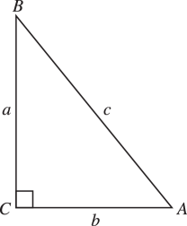
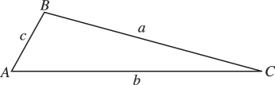
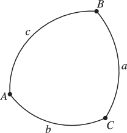

# §4.42 Solution of Triangles

:::{note}
**Keywords:**

[applications](http://dlmf.nist.gov/search/search?q=applications) , [solution of](http://dlmf.nist.gov/search/search?q=solution%20of) , [solution of triangles and spherical triangles](http://dlmf.nist.gov/search/search?q=solution%20of%20triangles%20and%20spherical%20triangles) , [triangles](http://dlmf.nist.gov/search/search?q=triangles) , [trigonometric functions](http://dlmf.nist.gov/search/search?q=trigonometric%20functions)

**See also:**

Annotations for Ch.4
:::

## §4.42(i) Planar Right Triangles

:::{note}
**Notes:**

See Hobson ([1928](./bib/H.html#bib1091 "A Treatise on Plane and Advanced Trigonometry"), p. 18).

**See also:**

Annotations for §4.42 and Ch.4
:::

:::{note}
**Defines:**

$A$ : angle (locally) , $B$ : angle (locally) , $C$ : right angle (locally) , $a$ : height (locally) , $b$ : base (locally) and $c$ : hypotenuse (locally)

**See also:**

Annotations for §4.42(i) , §4.42 and Ch.4
:::

$$
\sin A=\frac{a}{c}=\frac{1}{\csc A}, \tag{4.42.1}
$$

$$
\cos A=\frac{b}{c}=\frac{1}{\sec A}, \tag{4.42.2}
$$

$$
\tan A=\frac{a}{b}=\frac{1}{\cot A}. \tag{4.42.3}
$$

## §4.42(ii) Planar Triangles

:::{note}
**Notes:**

See Hobson ([1928](./bib/H.html#bib1091 "A Treatise on Plane and Advanced Trigonometry"), Chapter 10).

**See also:**

Annotations for §4.42 and Ch.4
:::

:::{note}
**Defines:**

$a$ : length (locally) , $b$ : base (locally) , $c$ : length (locally) , $A$ : angle (locally) , $B$ : angle (locally) and $C$ : angle (locally)

**See also:**

Annotations for §4.42(ii) , §4.42 and Ch.4
:::

$$
\frac{a}{\sin A}=\frac{b}{\sin B}=\frac{c}{\sin C}, \tag{4.42.4}
$$

$$
c^{2}=a^{2}+b^{2}-2ab\cos C, \tag{4.42.5}
$$

$$
a=b\cos C+c\cos B \tag{4.42.6}
$$

$$
\hbox{area}=\tfrac{1}{2}bc\sin A=\left(s(s-a)(s-b)(s-c)\right)^{1/2}, \tag{4.42.7}
$$

where $s=\tfrac{1}{2}(a+b+c)$ (the semiperimeter).

## §4.42(iii) Spherical Triangles

:::{note}
**Keywords:**

[solution of](http://dlmf.nist.gov/search/search?q=solution%20of) , [spherical triangles](http://dlmf.nist.gov/search/search?q=spherical%20triangles)

**See also:**

Annotations for §4.42 and Ch.4
:::

:::{note}
**Defines:**

$A$ : angle (locally) , $B$ : angle (locally) , $C$ : angle (locally) , $a$ : arc length (locally) , $b$ : arc length (locally) and $c$ : arc length (locally)

**See also:**

Annotations for §4.42(iii) , §4.42 and Ch.4
:::

$$
\cos a=\cos b\cos c+\sin b\sin c\cos A, \tag{4.42.8}
$$

$$
\frac{\sin A}{\sin a}=\frac{\sin B}{\sin b}=\frac{\sin C}{\sin c}, \tag{4.42.9}
$$

$$
\sin a\cos B=\cos b\sin c-\sin b\cos c\cos A, \tag{4.42.10}
$$

$$
\cos a\cos C=\sin a\cot b-\sin C\cot B, \tag{4.42.11}
$$

$$
\cos A=-\cos B\cos C+\sin B\sin C\cos a. \tag{4.42.12}
$$

For these and other formulas see Smart ([1962](./bib/S.html#bib2116 "Text-book on Spherical Astronomy"), Chapter 1).
