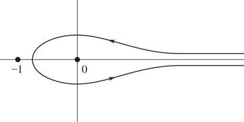

# §5.12 Beta Function

:::{note}
**Keywords:**

[beta function](http://dlmf.nist.gov/search/search?q=beta%20function)

**Notes:**

For ( 5.12.1 )–( 5.12.4 ) see Carlson ([1977b](./bib/C.html#bib434 "Special Functions of Applied Mathematics"), pp. 60 and 70). For ( 5.12.5 )–( 5.12.6 ) and ( 5.12.8 ) see Nielsen ([1906a](./bib/N.html#bib1718 "Handbuch der Theorie der Gammafunktion"), §64). For ( 5.12.7 ), ( 5.12.9 ), ( 5.12.10 ), and ( 5.12.12 ) see Temme ([1996b](./bib/T.html#bib2230 "Special Functions: An Introduction to the Classical Functions of Mathematical Physics"), pp. 74–75) and Olver ([1997b](./bib/O.html#bib1809 "Asymptotics and Special Functions"), p. 38). (An error in Ex.3.13 of Temme ([1996b](./bib/T.html#bib2230 "Special Functions: An Introduction to the Classical Functions of Mathematical Physics")) is corrected here.) ( 5.12.11 ) follows from ( 5.12.3 ).

**Referenced by:**

§18.15(i) , §18.17(v) , §19.1 , §19.16(ii) , §19.23 , §19.28 , §8.17(i)

**See also:**

Annotations for Ch.5
:::

In this section all fractional powers have their principal values, except where noted otherwise. In ( 5.12.1 )–( 5.12.4 ) it is assumed $\Re a>0$ and $\Re b>0$ .

:::{note}
**Keywords:**

[Euler’s beta integral](http://dlmf.nist.gov/search/search?q=Euler%20beta%20integral) , [beta function](http://dlmf.nist.gov/search/search?q=beta%20function) , [beta integrals](http://dlmf.nist.gov/search/search?q=beta%20integrals) , [definition](http://dlmf.nist.gov/search/search?q=definition) , [integral representations](http://dlmf.nist.gov/search/search?q=integral%20representations)

**See also:**

Annotations for §5.12 and Ch.5
:::

$$
\mathrm{B}\left(a,b\right)=\int_{0}^{1}t^{a-1}(1-t)^{b-1}\,\mathrm{d}t=\frac{\Gamma\left(a\right)\Gamma\left(b\right)}{\Gamma\left(a+b\right)}. \tag{5.12.1}
$$

$$
\int_{0}^{\pi/2}{\sin}^{2a-1}\theta{\cos}^{2b-1}\theta\,\mathrm{d}\theta=\tfrac{1}{2}\mathrm{B}\left(a,b\right). \tag{5.12.2}
$$

$$
\int_{0}^{\infty}\frac{t^{a-1}\,\mathrm{d}t}{(1+t)^{a+b}}=\mathrm{B}\left(a,b\right). \tag{5.12.3}
$$

$$
\int_{0}^{1}\frac{t^{a-1}(1-t)^{b-1}}{(t+z)^{a+b}}\,\mathrm{d}t=\mathrm{B}\left(a,b\right)(1+z)^{-a}z^{-b}, \tag{5.12.4}
$$

$$
\int_{0}^{\pi/2}(\cos t)^{a-1}\cos\left(bt\right)\,\mathrm{d}t=\frac{\pi}{2^{a}}\frac{1}{a\mathrm{B}\left(\frac{1}{2}(a+b+1),\frac{1}{2}(a-b+1)\right)}, \tag{5.12.5}
$$

$$
\int_{0}^{\pi}(\sin t)^{a-1}e^{ibt}\,\mathrm{d}t=\frac{\pi}{2^{a-1}}\frac{e^{i\pi b/2}}{a\mathrm{B}\left(\frac{1}{2}(a+b+1),\frac{1}{2}(a-b+1)\right)}, \tag{5.12.6}
$$

$$
\int_{0}^{\infty}\frac{\cosh\left(2bt\right)}{(\cosh t)^{2a}}\,\mathrm{d}t=4^{a-1}\mathrm{B}\left(a+b,a-b\right), \tag{5.12.7}
$$

$$
{\frac{1}{2\pi}\int_{-\infty}^{\infty}\frac{\,\mathrm{d}t}{(w+it)^{a}(z-it)^{b}}=\frac{(w+z)^{1-a-b}}{(a+b-1)\mathrm{B}\left(a,b\right)}}, \tag{5.12.8}
$$

In ( 5.12.8 ) the fractional powers have their principal values when $w>0$ and $z>0$ , and are continued via continuity.

$$
{\frac{1}{2\pi i}\int_{c-\infty i}^{c+\infty i}t^{-a}(1-t)^{-1-b}\,\mathrm{d}t=\frac{1}{b\mathrm{B}\left(a,b\right)}}, \tag{5.12.9}
$$

$$
{\frac{1}{2\pi i}\int_{0}^{(1+)}t^{a-1}(t-1)^{b-1}\,\mathrm{d}t=\frac{\sin\left(\pi b\right)}{\pi}\mathrm{B}\left(a,b\right)}, \tag{5.12.10}
$$

with the contour as shown in Figure 5.12.1 .

:::{note}
**Referenced by:**

§5.12

**See also:**

Annotations for §5.12 , §5.12 and Ch.5
:::

In ( 5.12.11 ) and ( 5.12.12 ) the fractional powers are continuous on the integration paths and take their principal values at the beginning.

$$
\frac{1}{e^{2\pi ia}-1}\int_{\infty}^{(0+)}t^{a-1}(1+t)^{-a-b}\,\mathrm{d}t=\mathrm{B}\left(a,b\right), \tag{5.12.11}
$$

when $\Re b>0$ , $a$ is not an integer and the contour cuts the real axis between $-1$ and the origin. See Figure 5.12.2 .

:::{note}
**Referenced by:**

§5.12

**See also:**

Annotations for §5.12 , §5.12 and Ch.5
:::

:::{note}
**Keywords:**

[Pochhammer’s integral](http://dlmf.nist.gov/search/search?q=Pochhammer%20integral) , [beta function](http://dlmf.nist.gov/search/search?q=beta%20function)

**See also:**

Annotations for §5.12 and Ch.5
:::

When $a,b\in\mathbb{C}$

$$
\int_{P}^{(1+,0+,1-,0-)}t^{a-1}(1-t)^{b-1}\,\mathrm{d}t=-4e^{\pi i(a+b)}\sin\left(\pi a\right)\sin\left(\pi b\right)\mathrm{B}\left(a,b\right), \tag{5.12.12}
$$

where the contour starts from an arbitrary point $P$ in the interval $(0,1)$ , circles $1$ and then $0$ in the positive sense, circles $1$ and then $0$ in the negative sense, and returns to $P$ . It can always be deformed into the contour shown in Figure 5.12.3 .

:::{note}
**Referenced by:**

Figure 13.4.1 , [Figure 13.4.1](./13.4.F1.mag.md "In §13.4 Integral Representations ‣ Kummer Functions ‣ Chapter 13 Confluent Hypergeometric Functions") , §15.6 , §31.9(i) , §5.12

**See also:**

Annotations for §5.12 , §5.12 and Ch.5
:::
