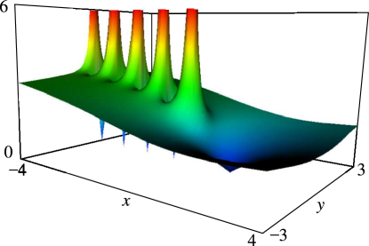

# §5.3 Graphics

:::{note}
**Keywords:**

[gamma function](http://dlmf.nist.gov/search/search?q=gamma%20function) , [graphics](http://dlmf.nist.gov/search/search?q=graphics)

**See also:**

Annotations for Ch.5
:::

## §5.3(i) Real Argument

:::{note}
**Keywords:**

[convexity](http://dlmf.nist.gov/search/search?q=convexity) , [gamma function](http://dlmf.nist.gov/search/search?q=gamma%20function) , [graphics](http://dlmf.nist.gov/search/search?q=graphics) , [logarithm](http://dlmf.nist.gov/search/search?q=logarithm) , [psi function](http://dlmf.nist.gov/search/search?q=psi%20function) , [reciprocal](http://dlmf.nist.gov/search/search?q=reciprocal)

**Notes:**

These graphs were produced at NIST.

**See also:**

Annotations for §5.3 and Ch.5
:::

:::{note}
**Symbols:**

$\Gamma\left(\NVar{z}\right)$: gamma function and $x$: real variable

**Referenced by:**

§5.4(iii)

**See also:**

Annotations for §5.3(i) , §5.3 and Ch.5
:::

:::{note}
**Symbols:**

$\Gamma\left(\NVar{z}\right)$: gamma function , $\ln\NVar{z}$: principal branch of logarithm function , $(\NVar{a},\NVar{b})$: open interval and $x$: real variable

**See also:**

Annotations for §5.3(i) , §5.3 and Ch.5
:::

:::{note}
**Symbols:**

$\psi\left(\NVar{z}\right)$: psi (or digamma) function and $x$: real variable

**See also:**

Annotations for §5.3(i) , §5.3 and Ch.5
:::

## §5.3(ii) Complex Argument

:::{note}
**Keywords:**

[gamma function](http://dlmf.nist.gov/search/search?q=gamma%20function) , [graphics](http://dlmf.nist.gov/search/search?q=graphics) , [psi function](http://dlmf.nist.gov/search/search?q=psi%20function) , [reciprocal](http://dlmf.nist.gov/search/search?q=reciprocal)

**Notes:**

These surfaces were produced at NIST.

**See also:**

Annotations for §5.3 and Ch.5
:::

In the graphics shown in this subsection, both the height and color correspond to the absolute value of the function. See also [About Color Map](./help/vrml/aboutcolor.md "In Viewing DLMF Interactive 3D Graphics ‣ Need Help?") .

:::{note}
**Symbols:**

$\Gamma\left(\NVar{z}\right)$: gamma function , $\mathrm{i}$: imaginary unit , $x$: real variable and $y$: real variable

**Referenced by:**

Graphics

**See also:**

Annotations for §5.3(ii) , §5.3 and Ch.5
:::

:::{note}
**Symbols:**

$\Gamma\left(\NVar{z}\right)$: gamma function , $\mathrm{i}$: imaginary unit , $x$: real variable and $y$: real variable

**See also:**

Annotations for §5.3(ii) , §5.3 and Ch.5
:::

:::{note}
**Symbols:**

$\psi\left(\NVar{z}\right)$: psi (or digamma) function , $\mathrm{i}$: imaginary unit , $x$: real variable and $y$: real variable

**Referenced by:**

Graphics

**See also:**

Annotations for §5.3(ii) , §5.3 and Ch.5
:::
