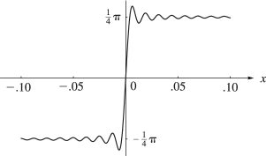
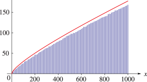

# §6.16 Mathematical Applications

:::{note}
**See also:**

Annotations for Ch.6
:::

## §6.16(i) The Gibbs Phenomenon

:::{note}
**Keywords:**

[Fourier-series expansions](http://dlmf.nist.gov/search/search?q=Fourier-series%20expansions) , [Gibbs phenomenon](http://dlmf.nist.gov/search/search?q=Gibbs%20phenomenon) , [applications](http://dlmf.nist.gov/search/search?q=applications) , [maxima and minima](http://dlmf.nist.gov/search/search?q=maxima%20and%20minima) , [nonuniformity of convergence](http://dlmf.nist.gov/search/search?q=nonuniformity%20of%20convergence) , [piecewise continuous functions](http://dlmf.nist.gov/search/search?q=piecewise%20continuous%20functions) , [sine integral](http://dlmf.nist.gov/search/search?q=sine%20integral) , [sine integrals](http://dlmf.nist.gov/search/search?q=sine%20integrals)

**Notes:**

See Temme ([1996b](./bib/T.html#bib2230 "Special Functions: An Introduction to the Classical Functions of Mathematical Physics"), pp. 181–182: the numerical value 1.089490⁢… on p. 182 should be replaced by 1.1789⁢…). Gibbs reported this phenomenon in a letter to Nature , 59 (1899, p. 606). Figure 6.16.1 was produced at NIST.

**Referenced by:**

§1.8(ii)

**See also:**

Annotations for §6.16 and Ch.6
:::

Consider the Fourier series

$$
\sin x+\tfrac{1}{3}\sin\left(3x\right)+\tfrac{1}{5}\sin\left(5x\right)+\dots=\begin{cases}\frac{1}{4}\pi,&0<x<\pi,\\
0,&x=0,\\
-\frac{1}{4}\pi,&-\pi<x<0.\end{cases} \tag{6.16.1}
$$

The $n$ th partial sum is given by

$$
S_{n}(x)=\sum_{k=0}^{n-1}\frac{\sin\left((2k+1)x\right)}{2k+1}=\frac{1}{2}\int_{0}^{x}\frac{\sin\left(2nt\right)}{\sin t}\,\mathrm{d}t=\tfrac{1}{2}\operatorname{Si}\left(2nx\right)+R_{n}(x), \tag{6.16.2}
$$

where

$$
R_{n}(x)=\frac{1}{2}\int_{0}^{x}\left(\frac{1}{\sin t}-\frac{1}{t}\right)\sin\left(2nt\right)\,\mathrm{d}t. \tag{6.16.3}
$$

By integration by parts

$$
R_{n}(x)=O\left(n^{-1}\right), \tag{6.16.4}
$$

uniformly for $x\in[-\pi,\pi]$ . Hence, if $x$ is fixed and $n\to\infty$ , then $S_{n}(x)\to\frac{1}{4}\pi$ , $0$ , or $-\frac{1}{4}\pi$ according as $0<x<\pi$ , $x=0$ , or $-\pi<x<0$ ; compare ( 6.2.14 ).

These limits are not approached uniformly, however. The first maximum of $\frac{1}{2}\operatorname{Si}\left(x\right)$ for positive $x$ occurs at $x=\pi$ and equals $(1.1789\dots)\times\frac{1}{4}\pi$ ; compare Figure 6.3.2 . Hence if $x=\pi/(2n)$ and $n\to\infty$ , then the limiting value of $S_{n}(x)$ overshoots $\frac{1}{4}\pi$ by approximately 18%. Similarly if $x=\pi/n$ , then the limiting value of $S_{n}(x)$ undershoots $\frac{1}{4}\pi$ by approximately 10%, and so on. Compare Figure 6.16.1 .

This nonuniformity of convergence is an illustration of the *Gibbs phenomenon* . It occurs with Fourier-series expansions of all piecewise continuous functions. See Carslaw ([1930](./bib/C.html#bib456 "Introduction to the Theory of Fourier’s Series and Integrals")) for additional graphs and information.

:::{note}
**Symbols:**

$x$: real variable , $n$: nonnegative integer and $S_{n}(x)$: partial sum

**Referenced by:**

§6.16(i) , §6.16(i)

**See also:**

Annotations for §6.16(i) , §6.16 and Ch.6
:::

## §6.16(ii) Number-Theoretic Significance of li⁡(x)

:::{note}
**Keywords:**

[logarithmic integral](http://dlmf.nist.gov/search/search?q=logarithmic%20integral) , [number-theoretic significance](http://dlmf.nist.gov/search/search?q=number-theoretic%20significance) , [prime numbers](http://dlmf.nist.gov/search/search?q=prime%20numbers) , [relation to logarithmic integral](http://dlmf.nist.gov/search/search?q=relation%20to%20logarithmic%20integral)

**Notes:**

Figure 6.16.2 was produced at NIST.

**See also:**

Annotations for §6.16 and Ch.6
:::

If we assume Riemann’s hypothesis that all nonreal zeros of $\zeta\left(s\right)$ have real part of $\tfrac{1}{2}$ (§ 25.10(i) ), then

$$
\operatorname{li}\left(x\right)-\pi(x)=O\left(\sqrt{x}\ln x\right), \tag{6.16.5}
$$

where $\pi(x)$ is the number of primes less than or equal to $x$ . Compare § [27.12](./27.12.md "§27.12 Asymptotic Formulas: Primes ‣ Multiplicative Number Theory ‣ Chapter 27 Functions of Number Theory") and Figure 6.16.2 . See also Bays and Hudson ([2000](./bib/B.html#bib223 "A new bound for the smallest x with > ⁢ π ( x ) ⁢ li ( x )")).

:::{note}
**Symbols:**

$\operatorname{li}\left(\NVar{x}\right)$: logarithmic integral , $x$: real variable and $\pi(x)$: number of primes $\leq x$

**Keywords:**

[graph](http://dlmf.nist.gov/search/search?q=graph) , [logarithmic integral](http://dlmf.nist.gov/search/search?q=logarithmic%20integral)

**Referenced by:**

§6.16(ii) , §6.16(ii) , §6.3(i)

**See also:**

Annotations for §6.16(ii) , §6.16 and Ch.6
:::
