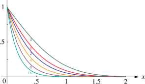

# §7.18 Repeated Integrals of the Complementary Error Function

:::{note}
**Keywords:**

[error functions](http://dlmf.nist.gov/search/search?q=error%20functions) , [repeated integrals of](http://dlmf.nist.gov/search/search?q=repeated%20integrals%20of) , [repeated integrals of the complementary error function](http://dlmf.nist.gov/search/search?q=repeated%20integrals%20of%20the%20complementary%20error%20function)

**Referenced by:**

§12.7(ii)

**See also:**

Annotations for Ch.7
:::

## §7.18(i) Definition

:::{note}
**Keywords:**

[definition](http://dlmf.nist.gov/search/search?q=definition) , [repeated integrals of the complementary error function](http://dlmf.nist.gov/search/search?q=repeated%20integrals%20of%20the%20complementary%20error%20function)

**See also:**

Annotations for §7.18 and Ch.7
:::

$$
\displaystyle\mathop{\mathrm{i}^{-1}\mathrm{erfc}}\left(z\right) \displaystyle=\frac{2}{\sqrt{\pi}}e^{-z^{2}}, \tag{7.18.1}
$$

$$
\displaystyle\mathop{\mathrm{i}^{0}\mathrm{erfc}}\left(z\right) \displaystyle=\operatorname{erfc}z,
$$

:::{note}
**Symbols:**

$\pi$: the ratio of the circumference of a circle to its diameter , $\operatorname{erfc}\NVar{z}$: complementary error function , $\mathrm{e}$: base of natural logarithm , $\mathop{\mathrm{i}^{\NVar{n}}\mathrm{erfc}}\left(\NVar{z}\right)$: repeated integrals of the complementary error function and $z$: complex variable

**A&S Ref:**

7.2.1 (in modified form)

**Referenced by:**

§7.22(iii)

**See also:**

Annotations for §7.18(i) , §7.18 and Ch.7
:::

and for $n=0,1,2,\dots$ ,

$$
\mathop{\mathrm{i}^{n}\mathrm{erfc}}\left(z\right)=\int_{z}^{\infty}\mathop{\mathrm{i}^{n-1}\mathrm{erfc}}\left(t\right)\,\mathrm{d}t=\frac{2}{\sqrt{\pi}}\int_{z}^{\infty}\frac{(t-z)^{n}}{n!}e^{-t^{2}}\,\mathrm{d}t. \tag{7.18.2}
$$

## §7.18(ii) Graphics

:::{note}
**Keywords:**

[repeated integrals of the complementary error function](http://dlmf.nist.gov/search/search?q=repeated%20integrals%20of%20the%20complementary%20error%20function) , [scaled](http://dlmf.nist.gov/search/search?q=scaled)

**Notes:**

These graphs were produced at NIST.

**See also:**

Annotations for §7.18 and Ch.7
:::

:::{note}
**Symbols:**

$\Gamma\left(\NVar{z}\right)$: gamma function , $\mathop{\mathrm{i}^{\NVar{n}}\mathrm{erfc}}\left(\NVar{z}\right)$: repeated integrals of the complementary error function , $x$: real variable and $n$: nonnegative integer

**Keywords:**

[graphics](http://dlmf.nist.gov/search/search?q=graphics) , [repeated integrals of the complementary error function](http://dlmf.nist.gov/search/search?q=repeated%20integrals%20of%20the%20complementary%20error%20function)

**See also:**

Annotations for §7.18(ii) , §7.18 and Ch.7
:::

## §7.18(iii) Properties

:::{note}
**Keywords:**

[derivatives](http://dlmf.nist.gov/search/search?q=derivatives) , [differential equation](http://dlmf.nist.gov/search/search?q=differential%20equation) , [power-series expansion](http://dlmf.nist.gov/search/search?q=power-series%20expansion) , [recurrence relations](http://dlmf.nist.gov/search/search?q=recurrence%20relations) , [repeated integrals of the complementary error function](http://dlmf.nist.gov/search/search?q=repeated%20integrals%20of%20the%20complementary%20error%20function)

**Notes:**

See Hartree ([1936](./bib/H.html#bib1052 "Some properties and applications of the repeated integrals of the error function")).

**See also:**

Annotations for §7.18 and Ch.7
:::

$$
\frac{\mathrm{d}}{\mathrm{d}z}\mathop{\mathrm{i}^{n}\mathrm{erfc}}\left(z\right)=-\mathop{\mathrm{i}^{n-1}\mathrm{erfc}}\left(z\right), \tag{7.18.3}
$$

$$
\frac{{\mathrm{d}}^{n}}{{\mathrm{d}z}^{n}}\left(e^{z^{2}}\operatorname{erfc}z\right)=(-1)^{n}2^{n}n!e^{z^{2}}\mathop{\mathrm{i}^{n}\mathrm{erfc}}\left(z\right), \tag{7.18.4}
$$

$$
\frac{{\mathrm{d}}^{2}W}{{\mathrm{d}z}^{2}}+2z\frac{\mathrm{d}W}{\mathrm{d}z}-2nW=0, \tag{7.18.5}
$$

where $n=1,2,3,\dots$ , and $A$ , $B$ are arbitrary constants.

$$
\mathop{\mathrm{i}^{n}\mathrm{erfc}}\left(z\right)=\sum_{k=0}^{\infty}\frac{(-1)^{k}z^{k}}{2^{n-k}k!\Gamma\left(1+\frac{1}{2}(n-k)\right)}. \tag{7.18.6}
$$

$$
\mathop{\mathrm{i}^{n}\mathrm{erfc}}\left(z\right)=-\frac{z}{n}\mathop{\mathrm{i}^{n-1}\mathrm{erfc}}\left(z\right)+\frac{1}{2n}\mathop{\mathrm{i}^{n-2}\mathrm{erfc}}\left(z\right), \tag{7.18.7}
$$

## §7.18(iv) Relations to Other Functions

:::{note}
**Notes:**

See Hartree ([1936](./bib/H.html#bib1052 "Some properties and applications of the repeated integrals of the error function")).

**Referenced by:**

Erratum (V1.0.21) for Paragraph Confluent Hypergeometric Functions (in §7.18(iv))

**See also:**

Annotations for §7.18 and Ch.7
:::

For the notation see §§ [18.3](./18.3.md "§18.3 Definitions ‣ Classical Orthogonal Polynomials ‣ Chapter 18 Orthogonal Polynomials") , 13.2(i) , and [12.2](./12.2.md "§12.2 Differential Equations ‣ Properties ‣ Chapter 12 Parabolic Cylinder Functions") .

### Hermite Polynomials

:::{note}
**Keywords:**

[Hermite polynomials](http://dlmf.nist.gov/search/search?q=Hermite%20polynomials) , [relations to other functions](http://dlmf.nist.gov/search/search?q=relations%20to%20other%20functions) , [repeated integrals of the complementary error function](http://dlmf.nist.gov/search/search?q=repeated%20integrals%20of%20the%20complementary%20error%20function)

**See also:**

Annotations for §7.18(iv) , §7.18 and Ch.7
:::

$$
(-1)^{n}\mathop{\mathrm{i}^{n}\mathrm{erfc}}\left(z\right)+\mathop{\mathrm{i}^{n}\mathrm{erfc}}\left(-z\right)=\frac{i^{-n}}{2^{n-1}n!}H_{n}\left(iz\right). \tag{7.18.8}
$$

### Confluent Hypergeometric Functions

:::{note}
**Keywords:**

[confluent hypergeometric functions](http://dlmf.nist.gov/search/search?q=confluent%20hypergeometric%20functions) , [relations to other functions](http://dlmf.nist.gov/search/search?q=relations%20to%20other%20functions) , [repeated integrals of error functions](http://dlmf.nist.gov/search/search?q=repeated%20integrals%20of%20error%20functions) , [repeated integrals of the complementary error function](http://dlmf.nist.gov/search/search?q=repeated%20integrals%20of%20the%20complementary%20error%20function)

**Referenced by:**

Erratum (V1.0.21) for Paragraph Confluent Hypergeometric Functions (in §7.18(iv))

**Clarification (effective with 1.0.21):**

A note about the multivalued nature of ( 7.18.10 ) was inserted just below it.

**See also:**

Annotations for §7.18(iv) , §7.18 and Ch.7
:::

$$
\mathop{\mathrm{i}^{n}\mathrm{erfc}}\left(z\right)=e^{-z^{2}}\left(\frac{1}{2^{n}\Gamma\left(\tfrac{1}{2}n+1\right)}M\left(\tfrac{1}{2}n+\tfrac{1}{2},\tfrac{1}{2},z^{2}\right)-\frac{z}{2^{n-1}\Gamma\left(\tfrac{1}{2}n+\tfrac{1}{2}\right)}M\left(\tfrac{1}{2}n+1,\tfrac{3}{2},z^{2}\right)\right), \tag{7.18.9}
$$

$$
\mathop{\mathrm{i}^{n}\mathrm{erfc}}\left(z\right)=\frac{e^{-z^{2}}}{2^{n}\sqrt{\pi}}U\left(\tfrac{1}{2}n+\tfrac{1}{2},\tfrac{1}{2},z^{2}\right). \tag{7.18.10}
$$

The confluent hypergeometric function on the right-hand side of ( 7.18.10 ) is multivalued and in the sectors $\tfrac{1}{2}\pi<\left|\operatorname{ph}z\right|<\pi$ one has to use the analytic continuation formula ( 13.2.12 ).

### Parabolic Cylinder Functions

:::{note}
**Keywords:**

[parabolic cylinder functions](http://dlmf.nist.gov/search/search?q=parabolic%20cylinder%20functions) , [relations to other functions](http://dlmf.nist.gov/search/search?q=relations%20to%20other%20functions) , [repeated integrals of the complementary error function](http://dlmf.nist.gov/search/search?q=repeated%20integrals%20of%20the%20complementary%20error%20function)

**See also:**

Annotations for §7.18(iv) , §7.18 and Ch.7
:::

$$
\mathop{\mathrm{i}^{n}\mathrm{erfc}}\left(z\right)=\frac{e^{-z^{2}/2}}{\sqrt{2^{n-1}\pi}}U\left(n+\tfrac{1}{2},z\sqrt{2}\right). \tag{7.18.11}
$$

### Probability Functions

:::{note}
**Keywords:**

[parabolic cylinder functions](http://dlmf.nist.gov/search/search?q=parabolic%20cylinder%20functions) , [probability functions](http://dlmf.nist.gov/search/search?q=probability%20functions) , [relations to other functions](http://dlmf.nist.gov/search/search?q=relations%20to%20other%20functions) , [repeated integrals of the complementary error function](http://dlmf.nist.gov/search/search?q=repeated%20integrals%20of%20the%20complementary%20error%20function)

**See also:**

Annotations for §7.18(iv) , §7.18 and Ch.7
:::

$$
\mathop{\mathrm{i}^{n}\mathrm{erfc}}\left(z\right)=\frac{1}{\sqrt{2^{n-1}\pi}}\mathit{Hh}_{n}\left(\sqrt{2}z\right). \tag{7.18.12}
$$

See Jeffreys and Jeffreys ([1956](./bib/J.html#bib1166 "Methods of Mathematical Physics"), §§23.081–23.09).

## §7.18(v) Continued Fraction

:::{note}
**Keywords:**

[continued fractions](http://dlmf.nist.gov/search/search?q=continued%20fractions) , [repeated integrals of the complementary error function](http://dlmf.nist.gov/search/search?q=repeated%20integrals%20of%20the%20complementary%20error%20function)

**Notes:**

See Hartree ([1936](./bib/H.html#bib1052 "Some properties and applications of the repeated integrals of the error function")) and Lorentzen and Waadeland ([1992](./bib/L.html#bib1468 "Continued Fractions with Applications"), p. 577).

**See also:**

Annotations for §7.18 and Ch.7
:::

$$
\frac{\mathop{\mathrm{i}^{n}\mathrm{erfc}}\left(z\right)}{\mathop{\mathrm{i}^{n-1}\mathrm{erfc}}\left(z\right)}=\cfrac{1/2}{z+\cfrac{(n+1)/2}{z+\cfrac{(n+2)/2}{z+}}}\cdots, \tag{7.18.13}
$$

See also Cuyt et al. ([2008](./bib/C.html#bib608 "Handbook of Continued Fractions for Special Functions"), p. 269).

## §7.18(vi) Asymptotic Expansion

:::{note}
**Keywords:**

[asymptotic expansions](http://dlmf.nist.gov/search/search?q=asymptotic%20expansions) , [repeated integrals of the complementary error function](http://dlmf.nist.gov/search/search?q=repeated%20integrals%20of%20the%20complementary%20error%20function)

**Notes:**

See Hartree ([1936](./bib/H.html#bib1052 "Some properties and applications of the repeated integrals of the error function")).

**See also:**

Annotations for §7.18 and Ch.7
:::

$$
\mathop{\mathrm{i}^{n}\mathrm{erfc}}\left(z\right)\sim\frac{2}{\sqrt{\pi}}\frac{e^{-z^{2}}}{(2z)^{n+1}}\sum_{m=0}^{\infty}\frac{(-1)^{m}(2m+n)!}{n!m!(2z)^{2m}}, \tag{7.18.14}
$$
