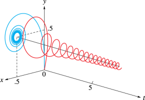

# §7.20 Mathematical Applications

:::{note}
**See also:**

Annotations for Ch.7
:::

## §7.20(i) Asymptotics

:::{note}
**Keywords:**

[Stokes phenomenon](http://dlmf.nist.gov/search/search?q=Stokes%20phenomenon) , [applications](http://dlmf.nist.gov/search/search?q=applications) , [asymptotic approximation of integrals](http://dlmf.nist.gov/search/search?q=asymptotic%20approximation%20of%20integrals) , [error functions](http://dlmf.nist.gov/search/search?q=error%20functions)

**See also:**

Annotations for §7.20 and Ch.7
:::

For applications of the complementary error function in uniform asymptotic approximations of integrals—saddle point coalescing with a pole or saddle point coalescing with an endpoint—see Wong ([1989](./bib/W.html#bib2438 "Asymptotic Approximations of Integrals"), Chapter 7), Olver ([1997b](./bib/O.html#bib1809 "Asymptotics and Special Functions"), Chapter 9), and van der Waerden ([1951](./bib/V.html#bib2314 "On the method of saddle points")).

The complementary error function also plays a ubiquitous role in constructing exponentially-improved asymptotic expansions and providing a smooth interpretation of the Stokes phenomenon; see §§ 2.11(iii) and 2.11(iv) .

## §7.20(ii) Cornu’s Spiral

:::{note}
**Keywords:**

[Cornu’s spiral](http://dlmf.nist.gov/search/search?q=Cornu%20spiral) , [Fresnel integrals](http://dlmf.nist.gov/search/search?q=Fresnel%20integrals) , [applications](http://dlmf.nist.gov/search/search?q=applications) , [connection with Fresnel integrals](http://dlmf.nist.gov/search/search?q=connection%20with%20Fresnel%20integrals)

**Notes:**

The diagram was provided by the author.

**See also:**

Annotations for §7.20 and Ch.7
:::

Let the set $\{x(t),y(t),t\}$ be defined by $x(t)=C\left(t\right)$ , $y(t)=S\left(t\right)$ , $t\geq 0$ . Then the set $\{x(t),y(t)\}$ is called *Cornu’s spiral* : it is the projection of the corkscrew on the $\{x,y\}$ -plane. See Figure 7.20.1 . The spiral has several special properties (see Temme ([1996b](./bib/T.html#bib2230 "Special Functions: An Introduction to the Classical Functions of Mathematical Physics"), p. 184)). Let $P(t)=P(x(t),y(t))$ be any point on the projected spiral. Then the arc length between the origin and $P(t)$ equals $t$ , and is directly proportional to the curvature at $P(t)$ , which equals $\pi t$ . Furthermore, because $\ifrac{\mathrm{d}y}{\mathrm{d}x}=\tan\left(\frac{1}{2}\pi t^{2}\right)$ , the angle between the $x$ -axis and the tangent to the spiral at $P(t)$ is given by $\frac{1}{2}\pi t^{2}$ .

:::{note}
**Symbols:**

$C\left(\NVar{z}\right)$: Fresnel integral , $S\left(\NVar{z}\right)$: Fresnel integral , $[\NVar{a},\NVar{b})$: half-closed interval and $\in$: element of

**Referenced by:**

§7.20(ii)

**See also:**

Annotations for §7.20(ii) , §7.20 and Ch.7
:::

## §7.20(iii) Statistics

:::{note}
**Keywords:**

[Fresnel integrals](http://dlmf.nist.gov/search/search?q=Fresnel%20integrals) , [applications](http://dlmf.nist.gov/search/search?q=applications) , [error functions](http://dlmf.nist.gov/search/search?q=error%20functions) , [probability theory](http://dlmf.nist.gov/search/search?q=probability%20theory) , [statistics](http://dlmf.nist.gov/search/search?q=statistics)

**See also:**

Annotations for §7.20 and Ch.7
:::

The normal distribution function with mean $m$ and standard deviation $\sigma$ is given by

$$
\frac{1}{\sigma\sqrt{2\pi}}\int_{-\infty}^{x}e^{-(t-m)^{2}/(2\sigma^{2})}\,\mathrm{d}t=\frac{1}{2}\operatorname{erfc}\left(\frac{m-x}{\sigma\sqrt{2}}\right)=Q\left(\frac{m-x}{\sigma}\right)=P\left(\frac{x-m}{\sigma}\right). \tag{7.20.1}
$$

For applications in statistics and probability theory, also for the role of the normal distribution functions (the error functions and probability integrals) in the asymptotics of arbitrary probability density functions, see Johnson et al. ([1994](./bib/J.html#bib1175 "Continuous Univariate Distributions"), Chapter 13) and Patel and Read ([1982](./bib/P.html#bib2678 "Handbook of the Normal Distribution"), Chapters 2 and 3).
