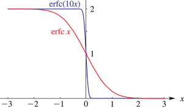
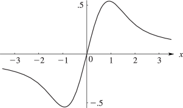
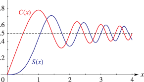
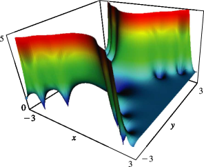
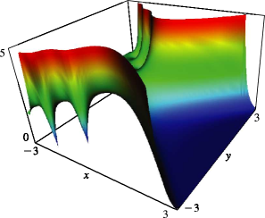

# §7.3 Graphics

:::{note}
**See also:**

Annotations for Ch.7
:::

## §7.3(i) Real Variable

:::{note}
**Notes:**

These graphs were produced at NIST.

**See also:**

Annotations for §7.3 and Ch.7
:::

:::{note}
**Symbols:**

$\operatorname{erfc}\NVar{z}$: complementary error function and $x$: real variable

**Keywords:**

[error functions](http://dlmf.nist.gov/search/search?q=error%20functions) , [graphics](http://dlmf.nist.gov/search/search?q=graphics)

**See also:**

Annotations for §7.3(i) , §7.3 and Ch.7
:::

:::{note}
**Symbols:**

$F\left(\NVar{z}\right)$: Dawson’s integral and $x$: real variable

**Keywords:**

[Dawson’s integral](http://dlmf.nist.gov/search/search?q=Dawson%20integral) , [graphics](http://dlmf.nist.gov/search/search?q=graphics)

**See also:**

Annotations for §7.3(i) , §7.3 and Ch.7
:::

:::{note}
**Symbols:**

$C\left(\NVar{z}\right)$: Fresnel integral , $S\left(\NVar{z}\right)$: Fresnel integral and $x$: real variable

**Keywords:**

[Fresnel integrals](http://dlmf.nist.gov/search/search?q=Fresnel%20integrals) , [Fresnel integrals and Cornu’s spiral](http://dlmf.nist.gov/search/search?q=Fresnel%20integrals%20and%20Cornu%20spiral) , [diffraction of light](http://dlmf.nist.gov/search/search?q=diffraction%20of%20light) , [graphics](http://dlmf.nist.gov/search/search?q=graphics)

**See also:**

Annotations for §7.3(i) , §7.3 and Ch.7
:::

:::{note}
**Symbols:**

$\mathcal{F}\left(\NVar{z}\right)$: Fresnel integral and $x$: real variable

**Keywords:**

[Fresnel integrals](http://dlmf.nist.gov/search/search?q=Fresnel%20integrals) , [applications](http://dlmf.nist.gov/search/search?q=applications) , [interference patterns](http://dlmf.nist.gov/search/search?q=interference%20patterns)

**Referenced by:**

§7.5 , Sidebar 7.SB1

**See also:**

Annotations for §7.3(i) , §7.3 and Ch.7
:::

## §7.3(ii) Complex Variable

:::{note}
**Notes:**

These surfaces were produced at NIST.

**See also:**

Annotations for §7.3 and Ch.7
:::

:::{note}
**Symbols:**

$\operatorname{erf}\NVar{z}$: error function , $\mathrm{i}$: imaginary unit and $x$: real variable

**Keywords:**

[error functions](http://dlmf.nist.gov/search/search?q=error%20functions) , [graphics](http://dlmf.nist.gov/search/search?q=graphics)

**Referenced by:**

§7.13(i)

**See also:**

Annotations for §7.3(ii) , §7.3 and Ch.7
:::

:::{note}
**Symbols:**

$\operatorname{erfc}\NVar{z}$: complementary error function , $\mathrm{i}$: imaginary unit and $x$: real variable

**Keywords:**

[error functions](http://dlmf.nist.gov/search/search?q=error%20functions) , [graphics](http://dlmf.nist.gov/search/search?q=graphics)

**Referenced by:**

§7.13(ii)

**See also:**

Annotations for §7.3(ii) , §7.3 and Ch.7
:::
