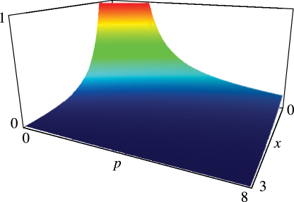
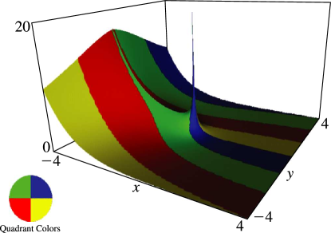
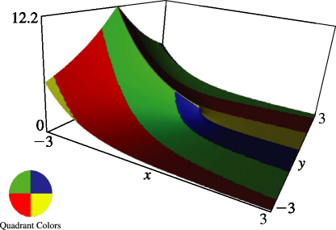

# §8.19 Generalized Exponential Integral

:::{note}
**Keywords:**

[exponential integrals](http://dlmf.nist.gov/search/search?q=exponential%20integrals) , [generalized](http://dlmf.nist.gov/search/search?q=generalized) , [generalized exponential integral](http://dlmf.nist.gov/search/search?q=generalized%20exponential%20integral)

**See also:**

Annotations for Ch.8
:::

## §8.19(i) Definition and Integral Representations

:::{note}
**Keywords:**

[definition](http://dlmf.nist.gov/search/search?q=definition) , [generalized exponential integral](http://dlmf.nist.gov/search/search?q=generalized%20exponential%20integral) , [incomplete gamma functions](http://dlmf.nist.gov/search/search?q=incomplete%20gamma%20functions) , [integral representations](http://dlmf.nist.gov/search/search?q=integral%20representations) , [principal values](http://dlmf.nist.gov/search/search?q=principal%20values) , [relations to other functions](http://dlmf.nist.gov/search/search?q=relations%20to%20other%20functions)

**Notes:**

See Temme ([1996b](./bib/T.html#bib2230 "Special Functions: An Introduction to the Classical Functions of Mathematical Physics"), p. 180).

**Referenced by:**

§13.6(ii) , §2.11(ii) , §7.11 , §8.4 , §8.8

**See also:**

Annotations for §8.19 and Ch.8
:::

For $p,z\in\mathbb{C}$

$$
E_{p}\left(z\right)=z^{p-1}\Gamma\left(1-p,z\right). \tag{8.19.1}
$$

Most properties of $E_{p}\left(z\right)$ follow straightforwardly from those of $\Gamma\left(a,z\right)$ . For an extensive treatment of $E_{1}\left(z\right)$ see Chapter [6](./6.md "Chapter 6 Exponential, Logarithmic, Sine, and Cosine Integrals") .

$$
E_{p}\left(z\right)=z^{p-1}\int_{z}^{\infty}\frac{e^{-t}}{t^{p}}\,\mathrm{d}t. \tag{8.19.2}
$$

When the path of integration excludes the origin and does not cross the negative real axis ( 8.19.2 ) defines the *principal value* of $E_{p}\left(z\right)$ , and *unless indicated otherwise* in the DLMF principal values are assumed.

### Other Integral Representations

:::{note}
**Keywords:**

[Mellin–Barnes type](http://dlmf.nist.gov/search/search?q=Mellin%E2%80%93Barnes%20type) , [generalized exponential integral](http://dlmf.nist.gov/search/search?q=generalized%20exponential%20integral) , [integral representations](http://dlmf.nist.gov/search/search?q=integral%20representations)

**See also:**

Annotations for §8.19(i) , §8.19 and Ch.8
:::

$$
\displaystyle E_{p}\left(z\right) \displaystyle=\int_{1}^{\infty}\frac{e^{-zt}}{t^{p}}\,\mathrm{d}t, \tag{8.19.3}
$$

:::{note}
**Symbols:**

$\pi$: the ratio of the circumference of a circle to its diameter , $\,\mathrm{d}\NVar{x}$: differential of $x$ , $\mathrm{e}$: base of natural logarithm , $E_{\NVar{p}}\left(\NVar{z}\right)$: generalized exponential integral , $\int$: integral , $\operatorname{ph}$: phase , $z$: complex variable and $p$: parameter

**Keywords:**

[Laplace transform](http://dlmf.nist.gov/search/search?q=Laplace%20transform) , [Mellin transform](http://dlmf.nist.gov/search/search?q=Mellin%20transform)

**A&S Ref:**

5.1.4

**Referenced by:**

§8.19(iii)

**See also:**

Annotations for §8.19(i) , §8.19(i) , §8.19 and Ch.8
:::

$$
\displaystyle E_{p}\left(z\right) \displaystyle=\frac{z^{p-1}e^{-z}}{\Gamma\left(p\right)}\int_{0}^{\infty}\frac{t^{p-1}e^{-zt}}{1+t}\,\mathrm{d}t, \tag{8.19.4}
$$

:::{note}
**Symbols:**

$\Gamma\left(\NVar{z}\right)$: gamma function , $\pi$: the ratio of the circumference of a circle to its diameter , $\,\mathrm{d}\NVar{x}$: differential of $x$ , $\mathrm{e}$: base of natural logarithm , $E_{\NVar{p}}\left(\NVar{z}\right)$: generalized exponential integral , $\int$: integral , $\operatorname{ph}$: phase , $\Re$: real part , $z$: complex variable and $p$: parameter

**Keywords:**

[Laplace transform](http://dlmf.nist.gov/search/search?q=Laplace%20transform) , [Mellin transform](http://dlmf.nist.gov/search/search?q=Mellin%20transform)

**See also:**

Annotations for §8.19(i) , §8.19(i) , §8.19 and Ch.8
:::

Integral representations of Mellin–Barnes type for $E_{p}\left(z\right)$ follow immediately from ( 8.6.11 ), ( 8.6.12 ), and ( 8.19.1 ).

## §8.19(ii) Graphics

:::{note}
**Keywords:**

[generalized exponential integral](http://dlmf.nist.gov/search/search?q=generalized%20exponential%20integral) , [graphics](http://dlmf.nist.gov/search/search?q=graphics)

**Notes:**

These graphics were produced at NIST.

**See also:**

Annotations for §8.19 and Ch.8
:::

:::{note}
**Symbols:**

$E_{\NVar{p}}\left(\NVar{z}\right)$: generalized exponential integral , $x$: real variable and $p$: parameter

**See also:**

Annotations for §8.19(ii) , §8.19 and Ch.8
:::

In Figures 8.19.2 – 8.19.5 , height corresponds to the absolute value of the function and color to the phase. See [About Color Map](./help/vrml/aboutcolor.md "In Viewing DLMF Interactive 3D Graphics ‣ Need Help?") .

:::{note}
**Symbols:**

$E_{\NVar{p}}\left(\NVar{z}\right)$: generalized exponential integral , $\mathrm{i}$: imaginary unit and $x$: real variable

**Referenced by:**

§8.19(ii)

**See also:**

Annotations for §8.19(ii) , §8.19 and Ch.8
:::

:::{note}
**Symbols:**

$E_{\NVar{p}}\left(\NVar{z}\right)$: generalized exponential integral , $\mathrm{i}$: imaginary unit and $x$: real variable

**See also:**

Annotations for §8.19(ii) , §8.19 and Ch.8
:::

## §8.19(iii) Special Values

:::{note}
**Keywords:**

[generalized exponential integral](http://dlmf.nist.gov/search/search?q=generalized%20exponential%20integral) , [special values](http://dlmf.nist.gov/search/search?q=special%20values)

**Notes:**

Use ( 8.19.1 ), ( 8.19.3 ), and ( 8.4.15 ).

**See also:**

Annotations for §8.19 and Ch.8
:::

$$
E_{0}\left(z\right)=z^{-1}e^{-z}, \tag{8.19.5}
$$

$$
E_{p}\left(0\right)=\frac{1}{p-1}, \tag{8.19.6}
$$

$$
E_{n}\left(z\right)=\frac{(-z)^{n-1}}{(n-1)!}E_{1}\left(z\right)+\frac{e^{-z}}{(n-1)!}\sum_{k=0}^{n-2}(n-k-2)!(-z)^{k}, \tag{8.19.7}
$$

## §8.19(iv) Series Expansions

:::{note}
**Keywords:**

[generalized exponential integral](http://dlmf.nist.gov/search/search?q=generalized%20exponential%20integral) , [series expansions](http://dlmf.nist.gov/search/search?q=series%20expansions)

**Notes:**

( 8.19.8 ) follows from ( 8.4.13 ) and ( 8.4.15 ). ( 8.19.9 ) follows from ( 6.6.3 ), ( 8.19.1 ), and ( 8.4.15 ). ( 8.19.10 ) and ( 8.19.11 ) follow from ( 8.19.1 ) and ( 8.7.3 ).

**Referenced by:**

§8.25(i)

**See also:**

Annotations for §8.19 and Ch.8
:::

For $n=1,2,3,\dots$ ,

$$
E_{n}\left(z\right)=\frac{(-z)^{n-1}}{(n-1)!}(\psi\left(n\right)-\ln z)-\sum_{\begin{subarray}{c}k=0\\
k\neq n-1\end{subarray}}^{\infty}\frac{(-z)^{k}}{k!(1-n+k)}, \tag{8.19.8}
$$

and

$$
E_{n}\left(z\right)=\frac{(-1)^{n}z^{n-1}}{(n-1)!}\ln z+\frac{e^{-z}}{(n-1)!}\sum_{k=1}^{n-1}(-z)^{k-1}\Gamma\left(n-k\right)+\frac{e^{-z}(-z)^{n-1}}{(n-1)!}\sum_{k=0}^{\infty}\frac{z^{k}}{k!}\psi\left(k+1\right), \tag{8.19.9}
$$

with $|\operatorname{ph}z|\leq\pi$ in both equations. For $\psi\left(x\right)$ see § 5.2(i) .

When $p\in\mathbb{C}$

$$
E_{p}\left(z\right)=z^{p-1}\Gamma\left(1-p\right)-\sum_{k=0}^{\infty}\frac{(-z)^{k}}{k!(1-p+k)}, \tag{8.19.10}
$$

$$
E_{p}\left(z\right)=\Gamma\left(1-p\right)\left(z^{p-1}-e^{-z}\sum_{k=0}^{\infty}\frac{z^{k}}{\Gamma\left(2-p+k\right)}\right), \tag{8.19.11}
$$

again with $|\operatorname{ph}z|\leq\pi$ in both equations. The right-hand sides are replaced by their limiting forms when $p=1,2,3,\dots$ .

## §8.19(v) Recurrence Relation and Derivatives

:::{note}
**Keywords:**

[derivatives](http://dlmf.nist.gov/search/search?q=derivatives) , [generalized exponential integral](http://dlmf.nist.gov/search/search?q=generalized%20exponential%20integral) , [recurrence relation](http://dlmf.nist.gov/search/search?q=recurrence%20relation)

**Notes:**

Combine ( 8.19.1 ) with ( 8.8.2 ), ( 8.8.16 ), and ( 8.8.19 ).

**See also:**

Annotations for §8.19 and Ch.8
:::

$$
pE_{p+1}\left(z\right)+zE_{p}\left(z\right)=e^{-z}. \tag{8.19.12}
$$

$$
\displaystyle\frac{\mathrm{d}}{\mathrm{d}z}E_{p}\left(z\right) \displaystyle=-E_{p-1}\left(z\right), \tag{8.19.13}
$$

:::{note}
**Symbols:**

$\frac{\mathrm{d}\NVar{f}}{\mathrm{d}\NVar{x}}$: derivative of $f$ with respect to $x$ , $E_{\NVar{p}}\left(\NVar{z}\right)$: generalized exponential integral , $z$: complex variable and $p$: parameter

**A&S Ref:**

5.1.36 (Extended to general values of $p$ .)

**Referenced by:**

§8.19(x)

**See also:**

Annotations for §8.19(v) , §8.19 and Ch.8
:::

$$
\displaystyle\frac{\mathrm{d}}{\mathrm{d}z}(e^{z}E_{p}\left(z\right)) \displaystyle=e^{z}E_{p}\left(z\right)\left(1+\frac{p-1}{z}\right)-\frac{1}{z}. \tag{8.19.14}
$$

:::{note}
**Symbols:**

$\frac{\mathrm{d}\NVar{f}}{\mathrm{d}\NVar{x}}$: derivative of $f$ with respect to $x$ , $\mathrm{e}$: base of natural logarithm , $E_{\NVar{p}}\left(\NVar{z}\right)$: generalized exponential integral , $z$: complex variable and $p$: parameter

**See also:**

Annotations for §8.19(v) , §8.19 and Ch.8
:::

### p-Derivatives

:::{note}
**See also:**

Annotations for §8.19(v) , §8.19 and Ch.8
:::

For $j=1,2,3,\dots$ ,

$$
\frac{{\partial}^{j}E_{p}\left(z\right)}{{\partial p}^{j}}=(-1)^{j}\int_{1}^{\infty}(\ln t)^{j}t^{-p}e^{-zt}\,\mathrm{d}t, \tag{8.19.15}
$$

For properties and numerical tables see Milgram ([1985](./bib/M.html#bib1614 "The generalized integro-exponential function")), and also (when $p=1$ ) MacLeod ([2002b](./bib/M.html#bib1528 "The efficient computation of some generalised exponential integrals")).

## §8.19(vi) Relation to Confluent Hypergeometric Function

:::{note}
**Keywords:**

[confluent hypergeometric functions](http://dlmf.nist.gov/search/search?q=confluent%20hypergeometric%20functions) , [generalized exponential integral](http://dlmf.nist.gov/search/search?q=generalized%20exponential%20integral) , [relations to other functions](http://dlmf.nist.gov/search/search?q=relations%20to%20other%20functions)

**Notes:**

Use ( 8.19.1 ) and ( 8.5.3 ).

**See also:**

Annotations for §8.19 and Ch.8
:::

$$
E_{p}\left(z\right)=z^{p-1}e^{-z}U\left(p,p,z\right). \tag{8.19.16}
$$

For $U\left(a,b,z\right)$ see § 13.2(i) .

## §8.19(vii) Continued Fraction

:::{note}
**Keywords:**

[continued fraction](http://dlmf.nist.gov/search/search?q=continued%20fraction) , [generalized exponential integral](http://dlmf.nist.gov/search/search?q=generalized%20exponential%20integral)

**Notes:**

Combine ( 8.9.2 ) and ( 8.19.1 ).

**Referenced by:**

§3.10(ii)

**See also:**

Annotations for §8.19 and Ch.8
:::

$$
E_{p}\left(z\right)=e^{-z}\left(\cfrac{1}{z+\cfrac{p}{1+\cfrac{1}{z+\cfrac{p+1}{1+\cfrac{2}{z+\cdots}}}}}\right), \tag{8.19.17}
$$

See also Cuyt et al. ([2008](./bib/C.html#bib608 "Handbook of Continued Fractions for Special Functions"), pp. 277–285).

## §8.19(viii) Analytic Continuation

:::{note}
**Keywords:**

[analytic continuation](http://dlmf.nist.gov/search/search?q=analytic%20continuation) , [generalized exponential integral](http://dlmf.nist.gov/search/search?q=generalized%20exponential%20integral)

**Notes:**

See Olver ([1994b](./bib/O.html#bib1807 "The Generalized Exponential Integral")).

**See also:**

Annotations for §8.19 and Ch.8
:::

The general function $E_{p}\left(z\right)$ is attained by extending the path in ( 8.19.2 ) across the negative real axis. Unless $p$ is a nonpositive integer, $E_{p}\left(z\right)$ has a branch point at $z=0$ . For $z\neq 0$ each branch of $E_{p}\left(z\right)$ is an entire function of $p$ .

$$
E_{p}\left(ze^{2m\pi i}\right)=\frac{2\pi ie^{mp\pi i}}{\Gamma\left(p\right)}\frac{\sin\left(mp\pi\right)}{\sin\left(p\pi\right)}z^{p-1}+E_{p}\left(z\right), \tag{8.19.18}
$$

## §8.19(ix) Inequalities

:::{note}
**Keywords:**

[generalized exponential integral](http://dlmf.nist.gov/search/search?q=generalized%20exponential%20integral) , [inequalities](http://dlmf.nist.gov/search/search?q=inequalities)

**Notes:**

See Hopf ([1934](./bib/H.html#bib1096 "Mathematical Problems of Radiative Equilibrium"), pp. 26–27).

**See also:**

Annotations for §8.19 and Ch.8
:::

For $n=1,2,3,\dots$ and $x>0$ ,

$$
\frac{n-1}{n}E_{n}\left(x\right)<E_{n+1}\left(x\right)<E_{n}\left(x\right), \tag{8.19.19}
$$

$$
\left(E_{n}\left(x\right)\right)^{2}<E_{n-1}\left(x\right)E_{n+1}\left(x\right), \tag{8.19.20}
$$

$$
\frac{1}{x+n}<e^{x}E_{n}\left(x\right)\leq\frac{1}{x+n-1}, \tag{8.19.21}
$$

$$
\frac{\mathrm{d}}{\mathrm{d}x}\frac{E_{n}\left(x\right)}{E_{n-1}\left(x\right)}>0. \tag{8.19.22}
$$

## §8.19(x) Integrals

:::{note}
**Keywords:**

[generalized exponential integral](http://dlmf.nist.gov/search/search?q=generalized%20exponential%20integral) , [integrals](http://dlmf.nist.gov/search/search?q=integrals)

**Notes:**

See Kourganoff ([1952](./bib/K.html#bib1338 "Basic Methods in Transfer Problems. Radiative Equilibrium and Neutron Diffusion"), Appendix 1). For ( 8.19.23 ) use ( 8.19.13 ).

**See also:**

Annotations for §8.19 and Ch.8
:::

$$
\int_{z}^{\infty}E_{p-1}\left(t\right)\,\mathrm{d}t=E_{p}\left(z\right), \tag{8.19.23}
$$

$$
\int_{0}^{\infty}e^{-at}E_{n}\left(t\right)\,\mathrm{d}t=\frac{(-1)^{n-1}}{a^{n}}\left(\ln\left(1+a\right)+\sum_{k=1}^{n-1}\frac{(-1)^{k}a^{k}}{k}\right), \tag{8.19.24}
$$

$$
\int_{0}^{\infty}e^{-at}t^{b-1}E_{p}\left(t\right)\,\mathrm{d}t=\frac{\Gamma\left(b\right)(1+a)^{-b}}{p+b-1}\*F\left(1,b;p+b;a/(1+a)\right), \tag{8.19.25}
$$

$$
\int_{0}^{\infty}E_{p}\left(t\right)E_{q}\left(t\right)\,\mathrm{d}t=\frac{L(p)+L(q)}{p+q-1}, \tag{8.19.26}
$$

where

$$
L(p)=\int_{0}^{\infty}e^{-t}E_{p}\left(t\right)\,\mathrm{d}t=\frac{1}{2p}F\left(1,1;1+p;\tfrac{1}{2}\right), \tag{8.19.27}
$$

For the hypergeometric function $F\left(a,b;c;z\right)$ see § 15.2(i) . When $p=1,2,3,\dots$ , $L(p)$ can also be evaluated via ( 8.19.24 ).

For collections of integrals involving $E_{p}\left(z\right)$ , especially for integer $p$ , see Apelblat ([1983](./bib/index.html#bib111 "Table of Definite and Infinite Integrals"), §§7.1–7.2) and LeCaine ([1945](./bib/L.html#bib1395 "A table of integrals involving the functions ⁢ E n ( x )")).

## §8.19(xi) Further Generalizations

:::{note}
**Keywords:**

[further generalizations](http://dlmf.nist.gov/search/search?q=further%20generalizations) , [generalized exponential integral](http://dlmf.nist.gov/search/search?q=generalized%20exponential%20integral)

**See also:**

Annotations for §8.19 and Ch.8
:::

For higher-order generalized exponential integrals see Meijer and Baken ([1987](./bib/M.html#bib1594 "The exponential integral distribution")) and Milgram ([1985](./bib/M.html#bib1614 "The generalized integro-exponential function")).
