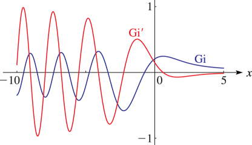

# §9.12 Scorer Functions

:::{note}
**Keywords:**

[Scorer functions](http://dlmf.nist.gov/search/search?q=Scorer%20functions)

**Referenced by:**

§2.4(v) , §3.5(ix) , §9.10(i)

**See also:**

Annotations for Ch.9
:::

## §9.12(i) Differential Equation

:::{note}
**Keywords:**

[Scorer functions](http://dlmf.nist.gov/search/search?q=Scorer%20functions) , [analytic properties](http://dlmf.nist.gov/search/search?q=analytic%20properties) , [definition](http://dlmf.nist.gov/search/search?q=definition) , [differential equation](http://dlmf.nist.gov/search/search?q=differential%20equation) , [integral representations](http://dlmf.nist.gov/search/search?q=integral%20representations) , [standard solutions](http://dlmf.nist.gov/search/search?q=standard%20solutions)

**Notes:**

See Olver ([1997b](./bib/O.html#bib1809 "Asymptotics and Special Functions"), pp. 430–431).

**Referenced by:**

§11.11(iii)

**See also:**

Annotations for §9.12 and Ch.9
:::

$$
\frac{{\mathrm{d}}^{2}w}{{\mathrm{d}z}^{2}}-zw=\frac{1}{\pi}. \tag{9.12.1}
$$

Solutions of this equation are the *Scorer functions* and can be found by the method of variation of parameters (§ 1.13(iii) ). The general solution is given by

$$
w(z)=Aw_{1}(z)+Bw_{2}(z)+p(z), \tag{9.12.2}
$$

where $A$ and $B$ are arbitrary constants, $w_{1}(z)$ and $w_{2}(z)$ are any two linearly independent solutions of Airy’s equation ( 9.2.1 ), and $p(z)$ is any particular solution of ( 9.12.1 ). Standard particular solutions are

$$
-\operatorname{Gi}\left(z\right) \tag{9.12.3}
$$

$$
\operatorname{Hi}\left(z\right)
$$

$$
e^{\mp 2\pi i/3}\operatorname{Hi}\left(ze^{\mp 2\pi i/3}\right)
$$

:::{note}
**Symbols:**

$\operatorname{Gi}\left(\NVar{z}\right)$: Scorer function (inhomogeneous Airy function) , $\operatorname{Hi}\left(\NVar{z}\right)$: Scorer function (inhomogeneous Airy function) , $\pi$: the ratio of the circumference of a circle to its diameter , $\mathrm{e}$: base of natural logarithm , $\mathrm{i}$: imaginary unit and $z$: complex variable

**Source:**

Olver ([1997b](./bib/O.html#bib1809 "Asymptotics and Special Functions"), p. 430)

**See also:**

Annotations for §9.12(i) , §9.12 and Ch.9
:::

where

$$
\operatorname{Gi}\left(z\right)=\operatorname{Bi}\left(z\right)\int_{z}^{\infty}\operatorname{Ai}\left(t\right)\,\mathrm{d}t+\operatorname{Ai}\left(z\right)\int_{0}^{z}\operatorname{Bi}\left(t\right)\,\mathrm{d}t, \tag{9.12.4}
$$

$$
\operatorname{Hi}\left(z\right)=\operatorname{Bi}\left(z\right)\int_{-\infty}^{z}\operatorname{Ai}\left(t\right)\,\mathrm{d}t-\operatorname{Ai}\left(z\right)\int_{-\infty}^{z}\operatorname{Bi}\left(t\right)\,\mathrm{d}t. \tag{9.12.5}
$$

$\operatorname{Gi}\left(z\right)$ and $\operatorname{Hi}\left(z\right)$ are entire functions of $z$ .

## §9.12(ii) Graphs

:::{note}
**Keywords:**

[Scorer functions](http://dlmf.nist.gov/search/search?q=Scorer%20functions) , [graphs](http://dlmf.nist.gov/search/search?q=graphs)

**Notes:**

These graphs were produced by NIST.

**See also:**

Annotations for §9.12 and Ch.9
:::

See Figures 9.12.1 and 9.12.2 .

:::{note}
**Symbols:**

$\operatorname{Gi}\left(\NVar{z}\right)$: Scorer function (inhomogeneous Airy function) and $x$: real variable

**Referenced by:**

§9.12(ii) , §9.12(ix)

**See also:**

Annotations for §9.12(ii) , §9.12 and Ch.9
:::

## §9.12(iii) Initial Values

:::{note}
**Keywords:**

[Scorer functions](http://dlmf.nist.gov/search/search?q=Scorer%20functions) , [differential equation](http://dlmf.nist.gov/search/search?q=differential%20equation) , [initial values](http://dlmf.nist.gov/search/search?q=initial%20values)

**Notes:**

See Olver ([1997b](./bib/O.html#bib1809 "Asymptotics and Special Functions"), p. 431).

**Referenced by:**

(9.12.11) , (9.12.12) , (9.12.13) , (9.12.14) , (9.12.20) , §9.12(v)

**See also:**

Annotations for §9.12 and Ch.9
:::

$$
\displaystyle\operatorname{Gi}\left(0\right) \displaystyle=\tfrac{1}{2}\operatorname{Hi}\left(0\right)=\tfrac{1}{3}\operatorname{Bi}\left(0\right)=1/\!\left(3^{7/6}\Gamma\left(\tfrac{2}{3}\right)\right)=0.20497\;55424\ldots, \tag{9.12.6}
$$

:::{note}
**Symbols:**

$\operatorname{Bi}\left(\NVar{z}\right)$: Airy function , $\Gamma\left(\NVar{z}\right)$: gamma function , $\operatorname{Gi}\left(\NVar{z}\right)$: Scorer function (inhomogeneous Airy function) and $\operatorname{Hi}\left(\NVar{z}\right)$: Scorer function (inhomogeneous Airy function)

**Source:**

Olver ([1997b](./bib/O.html#bib1809 "Asymptotics and Special Functions"), p. 431)

**See also:**

Annotations for §9.12(iii) , §9.12 and Ch.9
:::

$$
\displaystyle\operatorname{Gi}'\left(0\right) \displaystyle=\tfrac{1}{2}\operatorname{Hi}'\left(0\right)=\tfrac{1}{3}\operatorname{Bi}'\left(0\right)=1/\left(3^{5/6}\Gamma\left(\tfrac{1}{3}\right)\right)=0.14942\;94524\ldots. \tag{9.12.7}
$$

:::{note}
**Symbols:**

$\operatorname{Bi}\left(\NVar{z}\right)$: Airy function , $\Gamma\left(\NVar{z}\right)$: gamma function , $\operatorname{Gi}\left(\NVar{z}\right)$: Scorer function (inhomogeneous Airy function) and $\operatorname{Hi}\left(\NVar{z}\right)$: Scorer function (inhomogeneous Airy function)

**Source:**

Olver ([1997b](./bib/O.html#bib1809 "Asymptotics and Special Functions"), p. 431)

**See also:**

Annotations for §9.12(iii) , §9.12 and Ch.9
:::

## §9.12(iv) Numerically Satisfactory Solutions

:::{note}
**Keywords:**

[Scorer functions](http://dlmf.nist.gov/search/search?q=Scorer%20functions) , [differential equation](http://dlmf.nist.gov/search/search?q=differential%20equation) , [numerically satisfactory solutions](http://dlmf.nist.gov/search/search?q=numerically%20satisfactory%20solutions)

**Notes:**

Refer to the asymptotic expansions given in §§ 9.7(ii) and 9.12(viii) .

**See also:**

Annotations for §9.12 and Ch.9
:::

$-\operatorname{Gi}\left(x\right)$ is a numerically satisfactory companion to the complementary functions $\operatorname{Ai}\left(x\right)$ and $\operatorname{Bi}\left(x\right)$ on the interval $0\leq x<\infty$ . $\operatorname{Hi}\left(x\right)$ is a numerically satisfactory companion to $\operatorname{Ai}\left(x\right)$ and $\operatorname{Bi}\left(x\right)$ on the interval $-\infty<x\leq 0$ .

In $\mathbb{C}$ , numerically satisfactory sets of solutions are given by

$$
-\operatorname{Gi}\left(z\right),\operatorname{Ai}\left(z\right),\operatorname{Bi}\left(z\right), \tag{9.12.8}
$$

$$
\operatorname{Hi}\left(z\right),\operatorname{Ai}\left(ze^{-2\pi i/3}\right),\operatorname{Ai}\left(ze^{2\pi i/3}\right), \tag{9.12.9}
$$

and

$$
e^{\mp 2\pi i/3}\operatorname{Hi}\left(ze^{\mp 2\pi i/3}\right),\operatorname{Ai}\left(z\right),\operatorname{Ai}\left(ze^{\pm 2\pi i/3}\right), \tag{9.12.10}
$$

## §9.12(v) Connection Formulas

:::{note}
**Keywords:**

[Scorer functions](http://dlmf.nist.gov/search/search?q=Scorer%20functions) , [connection formulas](http://dlmf.nist.gov/search/search?q=connection%20formulas)

**Notes:**

These results can be verified with the aid of §§ 9.2(ii) and 9.12(iii) .

**See also:**

Annotations for §9.12 and Ch.9
:::

$$
\operatorname{Gi}\left(z\right)+\operatorname{Hi}\left(z\right)=\operatorname{Bi}\left(z\right), \tag{9.12.11}
$$

$$
\operatorname{Gi}\left(z\right)=\tfrac{1}{2}e^{\pi i/3}\operatorname{Hi}\left(ze^{-2\pi i/3}\right)+\tfrac{1}{2}e^{-\pi i/3}\operatorname{Hi}\left(ze^{2\pi i/3}\right), \tag{9.12.12}
$$

$$
\operatorname{Gi}\left(z\right)=e^{\mp\pi i/3}\operatorname{Hi}\left(ze^{\pm 2\pi i/3}\right)\pm i\operatorname{Ai}\left(z\right), \tag{9.12.13}
$$

$$
\operatorname{Hi}\left(z\right)=e^{\pm 2\pi i/3}\operatorname{Hi}\left(ze^{\pm
2\pi i/3}\right)+2e^{\mp\pi i/6}\operatorname{Ai}\left(ze^{\mp 2\pi i/3}\right). \tag{9.12.14}
$$

## §9.12(vi) Maclaurin Series

:::{note}
**Keywords:**

[Maclaurin series](http://dlmf.nist.gov/search/search?q=Maclaurin%20series) , [Scorer functions](http://dlmf.nist.gov/search/search?q=Scorer%20functions)

**Referenced by:**

§9.17(i)

**See also:**

Annotations for §9.12 and Ch.9
:::

$$
\operatorname{Gi}\left(z\right)=\frac{3^{-2/3}}{\pi}\*\sum_{k=0}^{\infty}\cos\left(\frac{2k-1}{3}\pi\right)\Gamma\left(\frac{k+1}{3}\right)\frac{(3^{1/3}z)^{k}}{k!}, \tag{9.12.15}
$$

$$
\operatorname{Gi}'\left(z\right)=\frac{3^{-1/3}}{\pi}\*\sum_{k=0}^{\infty}\cos\left(\frac{2k+1}{3}\pi\right)\Gamma\left(\frac{k+2}{3}\right)\frac{(3^{1/3}z)^{k}}{k!}. \tag{9.12.16}
$$

$$
\operatorname{Hi}\left(z\right)=\frac{3^{-2/3}}{\pi}\sum_{k=0}^{\infty}\Gamma\left(\frac{k+1}{3}\right)\frac{(3^{1/3}z)^{k}}{k!}, \tag{9.12.17}
$$

$$
\operatorname{Hi}'\left(z\right)=\frac{3^{-1/3}}{\pi}\sum_{k=0}^{\infty}\Gamma\left(\frac{k+2}{3}\right)\frac{(3^{1/3}z)^{k}}{k!}. \tag{9.12.18}
$$

## §9.12(vii) Integral Representations

:::{note}
**Keywords:**

[Scorer functions](http://dlmf.nist.gov/search/search?q=Scorer%20functions) , [integral representations](http://dlmf.nist.gov/search/search?q=integral%20representations) , [integrals of modified Bessel functions](http://dlmf.nist.gov/search/search?q=integrals%20of%20modified%20Bessel%20functions) , [over infinite intervals](http://dlmf.nist.gov/search/search?q=over%20infinite%20intervals)

**Notes:**

See Lee ([1980](./bib/L.html#bib1397 "The inhomogeneous Airy functions, ⁢ Gi ( z ) and ⁢ Hi ( z )")), Gordon ([1970](./bib/G.html#bib960 "Constructing wavefunctions for nonlocal potentials"), Appendix A), Exton ([1983](./bib/E.html#bib765 "The asymptotic behaviour of the inhomogeneous Airy function ⁢ Hi ( z )")).

**See also:**

Annotations for §9.12 and Ch.9
:::

$$
\operatorname{Gi}\left(x\right)=\frac{1}{\pi}\int_{0}^{\infty}\sin\left(\tfrac{1}{3}t^{3}+xt\right)\,\mathrm{d}t, \tag{9.12.19}
$$

$$
\operatorname{Hi}\left(z\right)=\frac{1}{\pi}\int_{0}^{\infty}\exp\left(-\tfrac{1}{3}t^{3}+zt\right)\,\mathrm{d}t, \tag{9.12.20}
$$

$$
\operatorname{Gi}\left(z\right)=-\frac{1}{\pi}\int_{0}^{\infty}\exp\left(-\tfrac{1}{3}t^{3}-\tfrac{1}{2}zt\right)\cos\left(\tfrac{1}{2}\sqrt{3}zt+\tfrac{2}{3}\pi\right)\,\mathrm{d}t. \tag{9.12.21}
$$

If $\zeta=\tfrac{2}{3}z^{3/2}$ or $\tfrac{2}{3}x^{3/2}$ , and $K_{1/3}$ is the modified Bessel function (§ 10.25(ii) ), then

$$
\displaystyle\operatorname{Hi}\left(-z\right) \displaystyle=\frac{4z^{2}}{3^{3/2}\pi^{2}}\int_{0}^{\infty}\frac{K_{1/3}\left(t\right)}{\zeta^{2}+t^{2}}\,\mathrm{d}t, \tag{9.12.22}
$$

:::{note}
**Symbols:**

$\operatorname{Hi}\left(\NVar{z}\right)$: Scorer function (inhomogeneous Airy function) , $\pi$: the ratio of the circumference of a circle to its diameter , $\,\mathrm{d}\NVar{x}$: differential of $x$ , $\int$: integral , $K_{\NVar{\nu}}\left(\NVar{z}\right)$: modified Bessel function of the second kind , $\operatorname{ph}$: phase , $z$: complex variable and $\zeta$: variable

**Source:**

Gordon ([1970](./bib/G.html#bib960 "Constructing wavefunctions for nonlocal potentials"), Appendix A)

**See also:**

Annotations for §9.12(vii) , §9.12 and Ch.9
:::

$$
\displaystyle\operatorname{Gi}\left(x\right) \displaystyle=\frac{4x^{2}}{3^{3/2}\pi^{2}}\pvint_{0}^{\infty}\frac{K_{1/3}\left(t\right)}{\zeta^{2}-t^{2}}\,\mathrm{d}t, \tag{9.12.23}
$$

:::{note}
**Symbols:**

$\operatorname{Gi}\left(\NVar{z}\right)$: Scorer function (inhomogeneous Airy function) , $\pi$: the ratio of the circumference of a circle to its diameter , $\,\mathrm{d}\NVar{x}$: differential of $x$ , $K_{\NVar{\nu}}\left(\NVar{z}\right)$: modified Bessel function of the second kind , $\pvint_{\NVar{a}}^{\NVar{b}}$: Cauchy principal value , $x$: real variable and $\zeta$: variable

**Source:**

Gordon ([1970](./bib/G.html#bib960 "Constructing wavefunctions for nonlocal potentials"), Appendix A)

**See also:**

Annotations for §9.12(vii) , §9.12 and Ch.9
:::

where the last integral is a Cauchy principal value (§ 1.4(v) ).

### Mellin–Barnes Type Integral

:::{note}
**Keywords:**

[Scorer functions](http://dlmf.nist.gov/search/search?q=Scorer%20functions) , [integral representations](http://dlmf.nist.gov/search/search?q=integral%20representations)

**See also:**

Annotations for §9.12(vii) , §9.12 and Ch.9
:::

$$
\operatorname{Hi}\left(z\right)=\frac{3^{-2/3}}{2\pi^{2}i}\int_{-i\infty}^{i\infty}\Gamma\left(\tfrac{1}{3}+\tfrac{1}{3}t\right)\Gamma\left(-t\right)(3^{1/3}e^{\pi i}z)^{t}\,\mathrm{d}t, \tag{9.12.24}
$$

where the integration contour separates the poles of $\Gamma\left(\tfrac{1}{3}+\tfrac{1}{3}t\right)$ from those of $\Gamma\left(-t\right)$ .

## §9.12(viii) Asymptotic Expansions

:::{note}
**Keywords:**

[Scorer functions](http://dlmf.nist.gov/search/search?q=Scorer%20functions) , [asymptotic expansions](http://dlmf.nist.gov/search/search?q=asymptotic%20expansions)

**Notes:**

see Olver ([1997b](./bib/O.html#bib1809 "Asymptotics and Special Functions"), pp. 431–432), Rothman ([1954a](./bib/R.html#bib1978 "Tables of the integrals and differential coefficients of ⁢ Gi ( + x ) and ⁢ Hi ( - x )")).

**Referenced by:**

§9.12(iv) , §9.17(i)

**See also:**

Annotations for §9.12 and Ch.9
:::

### Functions and Derivatives

:::{note}
**See also:**

Annotations for §9.12(viii) , §9.12 and Ch.9
:::

As $z\to\infty$ , and with $\delta$ denoting an arbitrary small positive constant,

$$
\operatorname{Gi}\left(z\right)\sim\frac{1}{\pi z}\sum_{k=0}^{\infty}\frac{(3k)!}{k!(3z^{3})^{k}}, \tag{9.12.25}
$$

$$
\operatorname{Gi}'\left(z\right)\sim-\frac{1}{\pi z^{2}}\sum_{k=0}^{\infty}\frac{(3k+1)!}{k!(3z^{3})^{k}}, \tag{9.12.26}
$$

$$
\operatorname{Hi}\left(z\right)\sim-\frac{1}{\pi z}\sum_{k=0}^{\infty}\frac{(3k)!}{k!(3z^{3})^{k}}, \tag{9.12.27}
$$

$$
\operatorname{Hi}'\left(z\right)\sim\frac{1}{\pi z^{2}}\sum_{k=0}^{\infty}\frac{(3k+1)!}{k!(3z^{3})^{k}}, \tag{9.12.28}
$$

For other phase ranges combine these results with the connection formulas ( 9.12.11 )–( 9.12.14 ) and the asymptotic expansions given in § [9.7](./9.7.md "§9.7 Asymptotic Expansions ‣ Airy Functions ‣ Chapter 9 Airy and Related Functions") . For example, with the notation of § 9.7(i) ,

$$
\operatorname{Hi}\left(z\right)\sim-\frac{1}{\pi z}\sum_{k=0}^{\infty}\frac{(3k)!}{k!(3z^{3})^{k}}+\frac{e^{\zeta}}{\sqrt{\pi}z^{1/4}}\sum_{k=0}^{\infty}\frac{u_{k}}{\zeta^{k}}, \tag{9.12.29}
$$

### Integrals

:::{note}
**Keywords:**

[Scorer functions](http://dlmf.nist.gov/search/search?q=Scorer%20functions) , [asymptotic expansions](http://dlmf.nist.gov/search/search?q=asymptotic%20expansions) , [integrals](http://dlmf.nist.gov/search/search?q=integrals)

**See also:**

Annotations for §9.12(viii) , §9.12 and Ch.9
:::

$$
\int_{0}^{z}\operatorname{Gi}\left(t\right)\,\mathrm{d}t\sim\frac{1}{\pi}\ln z+\frac{2\gamma+\ln 3}{3\pi}-\frac{1}{\pi}\sum_{k=1}^{\infty}\frac{(3k-1)!}{k!(3z^{3})^{k}}, \tag{9.12.30}
$$

$$
\int_{0}^{z}\operatorname{Hi}\left(-t\right)\,\mathrm{d}t\sim\frac{1}{\pi}\ln z+\frac{2\gamma+\ln 3}{3\pi}+\frac{1}{\pi}\sum_{k=1}^{\infty}(-1)^{k-1}\frac{(3k-1)!}{k!(3z^{3})^{k}}, \tag{9.12.31}
$$

where $\gamma$ is Euler’s constant (§ 5.2(ii) ).

## §9.12(ix) Zeros

:::{note}
**Keywords:**

[Scorer functions](http://dlmf.nist.gov/search/search?q=Scorer%20functions) , [zeros](http://dlmf.nist.gov/search/search?q=zeros)

**See also:**

Annotations for §9.12 and Ch.9
:::

All zeros, real or complex, of $\operatorname{Gi}\left(z\right)$ and $\operatorname{Hi}\left(z\right)$ are simple.

Neither $\operatorname{Hi}\left(z\right)$ nor $\operatorname{Hi}'\left(z\right)$ has real zeros.

$\operatorname{Gi}\left(z\right)$ has no nonnegative real zeros and $\operatorname{Gi}'\left(z\right)$ has exactly one nonnegative real zero, given by $z=0.60907\;54170\;7\dotsc$ . Both $\operatorname{Gi}\left(z\right)$ and $\operatorname{Gi}'\left(z\right)$ have an infinity of negative real zeros, and they are interlaced.

For the above properties and further results, including the distribution of complex zeros, asymptotic approximations for the numerically large real or complex zeros, and numerical tables see Gil et al. ([2003c](./bib/G.html#bib928 "On the zeros of the Scorer functions")).

For graphical illustration of the real zeros see Figures 9.12.1 and 9.12.2 .
