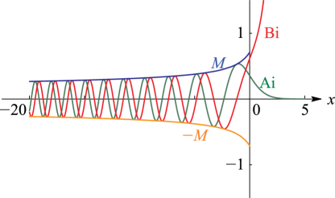
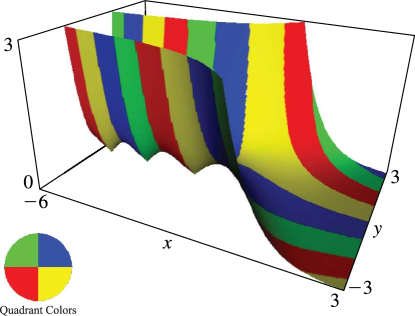
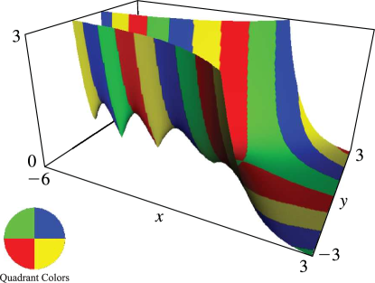

# §9.3 Graphics

:::{note}
**Keywords:**

[Airy functions](http://dlmf.nist.gov/search/search?q=Airy%20functions) , [graphics](http://dlmf.nist.gov/search/search?q=graphics)

**See also:**

Annotations for Ch.9
:::

## §9.3(i) Real Variable

:::{note}
**Keywords:**

[Airy functions](http://dlmf.nist.gov/search/search?q=Airy%20functions) , [graphs](http://dlmf.nist.gov/search/search?q=graphs) , [modulus and phase](http://dlmf.nist.gov/search/search?q=modulus%20and%20phase)

**Notes:**

These graphs were produced by NIST.

**Referenced by:**

§9.8(i)

**See also:**

Annotations for §9.3 and Ch.9
:::

:::{note}
**Symbols:**

$\operatorname{Ai}\left(\NVar{z}\right)$: Airy function , $\operatorname{Bi}\left(\NVar{z}\right)$: Airy function , $M\left(\NVar{z}\right)$: Airy modulus function and $x$: real variable

**See also:**

Annotations for §9.3(i) , §9.3 and Ch.9
:::

## §9.3(ii) Complex Variable

:::{note}
**Keywords:**

[Airy functions](http://dlmf.nist.gov/search/search?q=Airy%20functions) , [graphics](http://dlmf.nist.gov/search/search?q=graphics)

**Notes:**

These surfaces were produced by NIST.

**Referenced by:**

§9.9(i)

**See also:**

Annotations for §9.3 and Ch.9
:::

In the graphics shown in this subsection, height corresponds to the absolute value of the function and color to the phase. See also [About Color Map](./help/vrml/aboutcolor.md "In Viewing DLMF Interactive 3D Graphics ‣ Need Help?") .

:::{note}
**Symbols:**

$\operatorname{Ai}\left(\NVar{z}\right)$: Airy function , $\mathrm{i}$: imaginary unit and $x$: real variable

**See also:**

Annotations for §9.3(ii) , §9.3 and Ch.9
:::

:::{note}
**Symbols:**

$\operatorname{Ai}\left(\NVar{z}\right)$: Airy function , $\mathrm{i}$: imaginary unit and $x$: real variable

**See also:**

Annotations for §9.3(ii) , §9.3 and Ch.9
:::
